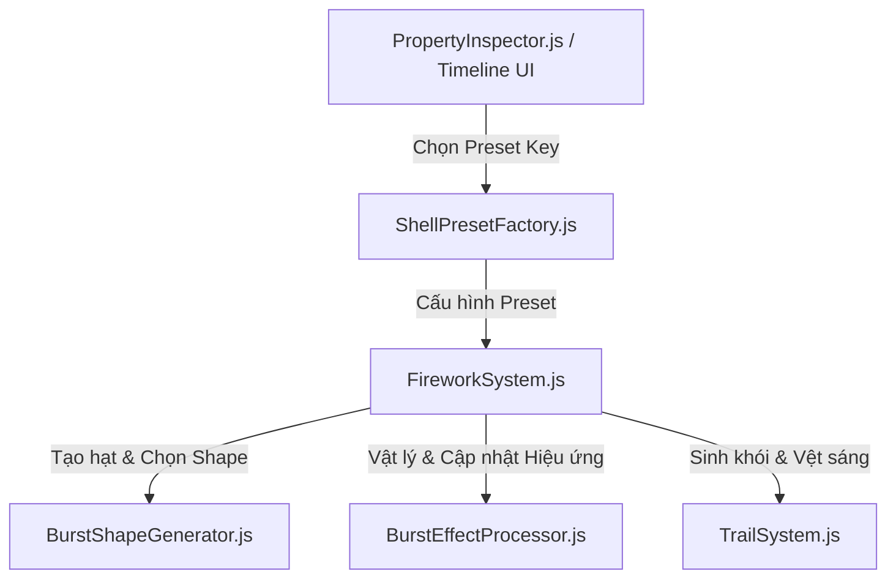

# Hướng dẫn tạo và chỉnh sửa Pháo hoa (Shell Creation Workflow)

Tài liệu này cung cấp bản đồ cấu trúc mã nguồn của hệ thống pháo hoa 3D, danh sách các file chịu trách nhiệm trong pipeline, cùng với các biểu mẫu code mẫu (code templates) và quy trình 4 bước để lập trình viên hoặc AI có thể nhanh chóng tạo hiệu ứng pháo hoa mới.

---

## 🗺️ Bản đồ Pipeline Pháo Hoa (Firework Pipeline Map)

Hệ thống pháo hoa được thiết kế theo dạng đường ống (pipeline) phân chia nhiệm vụ rõ ràng:



### 📂 Các tệp tin liên quan trực tiếp:

1. **Preset & Đăng ký (UI & Factory):**
   - [ShellPresetFactory.js](file:///e:/shell-drone-animation/src/factories/ShellPresetFactory.js): Nơi định nghĩa các bộ tham số pháo hoa mặc định (presets) như màu sắc, kích thước, hiệu ứng kích hoạt, hình dáng. Bạn cần khai báo preset mới tại đây để nó hiển thị lên giao diện Timeline.
   - [PropertyInspector.js](file:///e:/shell-drone-animation/src/ui/PropertyInspector.js): Giao diện hiển thị thuộc tính để chỉnh sửa thủ công cho từng sequence. Nó tự động đồng bộ danh sách preset từ factory.

2. **Hình học & Định hình hạt (Geometry & Coordinates):**
   - [BurstShapeGenerator.js](file:///e:/shell-drone-animation/src/factories/BurstShapeGenerator.js): Lớp tĩnh tính toán tọa độ vector 3D ban đầu cho các hạt khi pháo nổ (ví dụ: `sphere`, `ring`, `heart`, `star`, `willow`, `smiley`, v.v.). Thêm hình dáng mới tại đây.

3. **Vật lý & Động lực học hiệu ứng (Physics & Dynamic Effects):**
   - [BurstEffectProcessor.js](file:///e:/shell-drone-animation/src/factories/BurstEffectProcessor.js): Điều khiển vận tốc, trọng lực riêng biệt, tạo nhấp nháy (strobe), lách tách (crackle), vệt khói (trail) hoặc chuyển động sóng (wave) cho các hạt theo thời gian thực (realtime update). Thêm hiệu ứng rơi hay chuyển động mới tại đây.

4. **Trọng tâm hệ thống (System Engine):**
   - [FireworkSystem.js](file:///e:/shell-drone-animation/src/systems/FireworkSystem.js): Trái tim của hệ thống pháo hoa. Quản lý việc phóng quả pháo từ mặt đất, kích hoạt vụ nổ tại độ cao chỉ định, sinh vật thể Point Cloud của Three.js và cập nhật toàn bộ trạng thái trong vòng lặp render.
   - [TrailSystem.js](file:///e:/shell-drone-animation/src/systems/TrailSystem.js): Hệ thống sinh các hạt phụ cho vệt sáng comet rủ xuống hoặc bụi tia lửa lách tách khi pháo nổ.

---

## 📝 Biểu mẫu Code Mẫu (Code Templates)

### 1. Thêm Shape mới vào `BurstShapeGenerator.js`

Mở [BurstShapeGenerator.js](file:///e:/shell-drone-animation/src/factories/BurstShapeGenerator.js):
- **Bước A:** Đăng ký tên shape trong hàm static `resolveShape(shellType)`:
  ```javascript
  case 'my-custom-shape':
    return 'my-custom-shape';
  ```
- **Bước B:** Thêm logic tính toán hướng vector trong hàm static `direction(...)`:
  ```javascript
  if (shape === 'my-custom-shape') {
    // angle: góc phân bổ từ 0 đến 2*PI dựa trên chỉ số hạt
    // index: chỉ số hạt hiện tại
    // count: tổng số lượng hạt của vụ nổ
    const radius = 1.0;
    const x = Math.cos(angle) * radius;
    const y = Math.sin(angle) * radius;
    const z = (Math.random() - 0.5) * 0.2; // độ dày 3D
    return new THREE.Vector3(x, y, z).normalize();
  }
  ```

### 2. Thêm Hiệu ứng chuyển động mới vào `BurstEffectProcessor.js`

Mở [BurstEffectProcessor.js](file:///e:/shell-drone-animation/src/factories/BurstEffectProcessor.js):
- **Bước A:** Đăng ký tên hiệu ứng vào Set `SUPPORTED_EFFECTS`:
  ```javascript
  'my-custom-effect'
  ```
- **Bước B:** Cập nhật logic thay đổi vận tốc hạt trong `updateVelocity(...)`:
  ```javascript
  } else if (effectType === 'my-custom-effect') {
    gravityScale = 0.15; // Lực hút nhẹ
    // Thay đổi vận tốc dựa trên thời gian trôi qua (age)
    velocity.x += Math.sin(age * 5) * 0.05; 
    velocity.multiplyScalar(0.995); // Độ ma sát không khí
    
    // Nếu muốn sinh vệt sáng comet rủ xuống:
    spawnTrail = true;
    trailLife = 0.5; // Thời gian sống của hạt đuôi
    trailIntensity = 0.6; // Độ sáng của hạt đuôi
  }
  ```

### 3. Đăng ký Preset mới vào `ShellPresetFactory.js`

Mở [ShellPresetFactory.js](file:///e:/shell-drone-animation/src/factories/ShellPresetFactory.js):
- **Bước A:** Đăng ký preset vào danh sách hiển thị `presetMenuEntries` trong `constructor()`:
  ```javascript
  { key: 'myCustomPreset', label: 'My Custom Firework' }
  ```
- **Bước B:** Đăng ký key trong switch-case `createPresetByKey(key)`:
  ```javascript
  case 'myCustomPreset':
    return this.validatePreset(this.myCustomPresetShell(size));
  ```
- **Bước C:** Viết hàm cấu hình preset tương ứng:
  ```javascript
  myCustomPresetShell(size = 1) {
    return {
      ...this.basePreset(size),
      shellType: 'myCustomPreset',
      shapeType: 'my-custom-shape', // Tên shape đã khai báo ở BurstShapeGenerator
      effectType: 'my-custom-effect', // Tên effect đã khai báo ở BurstEffectProcessor
      strobe: true, // kích hoạt nhấp nháy phụ trợ
      particleCountMultiplier: 1.2 // số lượng hạt (nhân thêm 1.2 lần)
    };
  }
  ```

---

## 🚀 Quy trình 4 pha thiết kế và lập trình pháo hoa mới

Quy trình này tích hợp chặt chẽ việc thảo luận nhóm bằng `/bmad-party-mode` và quy trình lập kế hoạch (Planning Mode) để đảm bảo chất lượng hiệu ứng tốt nhất và đồng thuận cao trước khi sửa code:

### 1. Pha 1: Thảo luận & Khám phá ý tưởng (Discovery)
- **Hành động:** Luôn khởi đầu bằng cách gọi `/bmad-party-mode` để bắt đầu buổi thảo luận bàn tròn với các Agent chuyên gia (John, Sally, Winston, Amelia).
- **Mục tiêu:** Cùng thảo luận về ý tưởng nghệ thuật pháo hoa, cách phân bổ hạt, màu sắc chủ đạo, tốc độ di chuyển và các tham số chống chói lóa từ sớm.

### 2. Pha 2: Lập Kế hoạch (Planning)
- **Hành động:** Tạo hoặc cập nhật tệp `implementation_plan.md` trong thư mục Artifacts của phiên làm việc.
- **Mục tiêu:** Định hình chi tiết các file code cần sửa đổi và các biểu thức toán học sẽ áp dụng cho hiệu ứng.

### 3. Pha 3: Người dùng xác nhận (User Confirmation)
- **Hành động:** Gửi kế hoạch và dừng turn để chờ phản hồi xác nhận ("ok" hoặc chỉnh sửa) từ phía người dùng.
- **Mục tiêu:** Đảm bảo ý tưởng thiết kế khớp hoàn toàn với mong muốn của người dùng trước khi viết code.

### 4. Pha 4: Triển khai mã nguồn (Execution)
- **Hành động:** Tiến hành lập trình sửa đổi các tệp code nguồn trong pipeline sau khi nhận được sự phê duyệt:
  - Thiết kế hình học trong [BurstShapeGenerator.js](file:///e:/shell-drone-animation/src/factories/BurstShapeGenerator.js).
  - Viết logic vật lý hiệu ứng trong [BurstEffectProcessor.js](file:///e:/shell-drone-animation/src/factories/BurstEffectProcessor.js).
  - Đăng ký preset trong [ShellPresetFactory.js](file:///e:/shell-drone-animation/src/factories/ShellPresetFactory.js).
  - Tích hợp hệ thống trong [FireworkSystem.js](file:///e:/shell-drone-animation/src/systems/FireworkSystem.js).


> [!IMPORTANT]
> **Lưu ý về tài liệu:** Quy trình thêm pháo hoa mới tập trung hoàn toàn vào việc sửa đổi trực tiếp mã nguồn và cập nhật các tệp lập kế hoạch trong Artifacts. **Tuyệt đối không cần tạo thêm bất kỳ tệp tài liệu `.md` riêng biệt nào trong thư mục code nguồn của dự án** (ví dụ: các file giải thích hiệu ứng dạng `.md`), để tránh làm lộn xộn cấu trúc thư mục của dự án.
