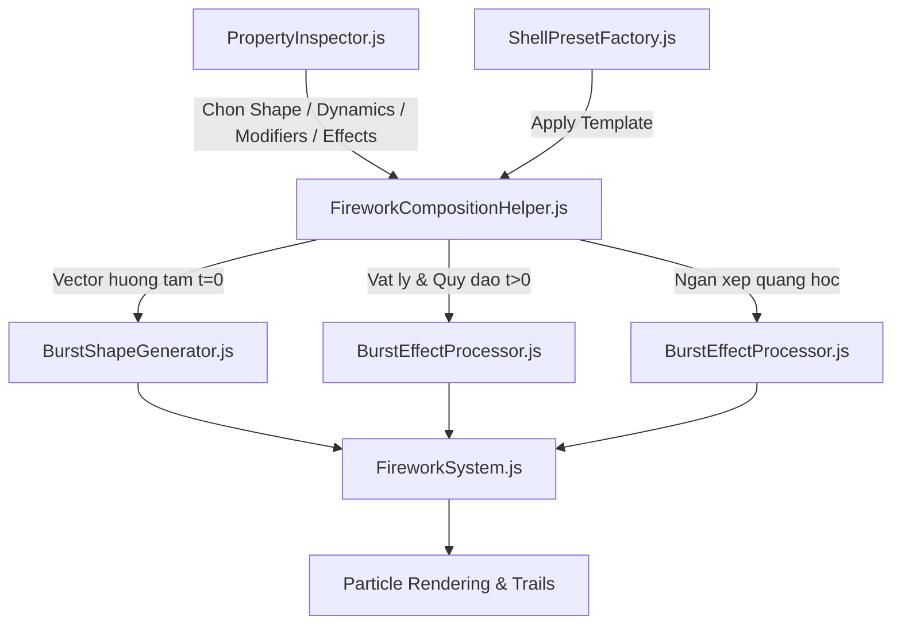

# Huong dan tao va chinh sua Phao hoa (Firework Composition Workflow)

Tai lieu nay cung cap ban do kien truc va quy trinh chuan de lap trinh vien hoac AI Agent them moi Hinh dang (Shape), Dong luc hoc no (Dynamics), Bo bo tro (Modifiers), Hieu ung quang hoc (Visual Effects) hoac Mau khoi dong nhanh (Preset Templates) theo dung mo hinh Component-based Composition.

---

## 1. Ban do Kien truc Composition (Composition Architecture Map)

He thong phao hoa hoat dong theo nguyen ly tach biet trach nhiem (Decoupled Components):


```mermaid
graph TD
    UI[PropertyInspector.js] -->|Chon Shape / Dynamics / Modifiers / Effects| COMP[FireworkCompositionHelper.js]
    PRESET[ShellPresetFactory.js] -->|Apply Template| COMP
    COMP -->|Vector huong tam t=0| SHAPE[BurstShapeGenerator.js]
    COMP -->|Vat ly & Quy dao t>0| DYN[BurstEffectProcessor.js]
    COMP -->|Ngan xep quang hoc| EFF[BurstEffectProcessor.js]
    SHAPE --> SYS[FireworkSystem.js]
    DYN --> SYS
    EFF --> SYS
    SYS --> PART[Particle Rendering & Trails]
```

### Cac tep tin chiu trach nhiem chinh:

1. **Quan ly Taxonomy & Templates:**
   - [FireworkCompositionHelper.js](file:///e:/shell-drone-animation/src/factories/FireworkCompositionHelper.js): Trung tam quan ly danh muc `AVAILABLE_SHAPES`, `AVAILABLE_DYNAMICS`, `AVAILABLE_MODIFIERS`, `AVAILABLE_EFFECT_TAGS` va `PRESET_TEMPLATES`.
2. **Hinh hoc khong gian (Shape - t = 0):**
   - [BurstShapeGenerator.js](file:///e:/shell-drone-animation/src/factories/BurstShapeGenerator.js): Tinh toan vector huong tam 3D ban dau cua cac hat. Tuyet doi khong chua logic vat ly hay hieu ung dong.
3. **Dong luc hoc & Vat ly hat (Dynamics - t > 0):**
   - [BurstEffectProcessor.js](file:///e:/shell-drone-animation/src/factories/BurstEffectProcessor.js): Dieu khien van toc, ma sat khong khi, trong luc rieng biet (vi du: flow, willow, falling-leaves, snow, wave, galaxy-spin, bouquet-comet).
4. **Hieu ung quang hoc (Visual Effects):**
   - [BurstEffectProcessor.js](file:///e:/shell-drone-animation/src/factories/BurstEffectProcessor.js): Xu ly nhap nhay (strobe, white-strobe, glitter-strobe), no lach tach (crackle), an hien (ghost), vet sang (trail).
5. **Giao dien bien tap & Khoi dong nhanh (UI & Preset Factory):**
   - [PropertyInspector.js](file:///e:/shell-drone-animation/src/ui/PropertyInspector.js): Render cac dropdown doc lap cho Shape, Dynamics va tag chips cho Visual Effects.
   - [ShellPresetFactory.js](file:///e:/shell-drone-animation/src/factories/ShellPresetFactory.js): Khai bao preset khoi dong nhanh.
6. **Da ngon ngu (Internationalization):**
   - [src/config/lang/](file:///e:/shell-drone-animation/src/config/lang/): `en.js`, `vi.js`, `zh.js`, `ja.js`.

---

## 2. Bieu mau huong dan lap trinh (Step-by-Step Guides)

### A. Them mot Hinh dang moi (New Shape)

1. **Buoc 1:** Them ten shape vao `AVAILABLE_SHAPES` trong [FireworkCompositionHelper.js](file:///e:/shell-drone-animation/src/factories/FireworkCompositionHelper.js).
2. **Buoc 2:** Dang ky shape trong `resolveShape(shellType)` cua [BurstShapeGenerator.js](file:///e:/shell-drone-animation/src/factories/BurstShapeGenerator.js).
3. **Buoc 3:** Viet logic tinh vector 3D trong `direction(...)` cua [BurstShapeGenerator.js](file:///e:/shell-drone-animation/src/factories/BurstShapeGenerator.js):
   ```javascript
   if (shape === 'my-shape') {
     const x = Math.cos(angle) * 1.0;
     const y = Math.sin(angle) * 1.0;
     const z = (Math.random() - 0.5) * 0.2;
     return new THREE.Vector3(x, y, z).normalize();
   }
   ```
4. **Buoc 4:** Khai bao he so hat trong `SHAPE_MULTIPLIERS` tai [src/config/fireworks.js](file:///e:/shell-drone-animation/src/config/fireworks.js).
5. **Buoc 5:** Them ban dich ten shape vao `options.shapeType` trong ca 4 file ngon ngu (`en.js`, `vi.js`, `zh.js`, `ja.js`).

---

### B. Them mot Dong luc hoc moi (New Dynamics)

1. **Buoc 1:** Them ten dynamics vao `AVAILABLE_DYNAMICS` trong [FireworkCompositionHelper.js](file:///e:/shell-drone-animation/src/factories/FireworkCompositionHelper.js).
2. **Buoc 2:** Dang ky ten dynamics vao `SUPPORTED_EFFECTS` va viet strategy trong [BurstEffectProcessor.js](file:///e:/shell-drone-animation/src/factories/BurstEffectProcessor.js):
   ```javascript
   BurstEffectProcessor.registerEffect('my-dynamics', {
     updateVelocity(velocity, index, deltaTime, age, maxLife, effectState) {
       velocity.y += Math.sin(age * 4) * 0.02;
       velocity.multiplyScalar(0.995);
       return {
         gravityScale: 0.15,
         spawnTrail: true,
         trailLife: 0.4,
         trailIntensity: 0.5
       };
     }
   });
   ```
3. **Buoc 3:** Khai bao he so hat trong `EFFECT_MULTIPLIERS` tai [src/config/fireworks.js](file:///e:/shell-drone-animation/src/config/fireworks.js).
4. **Buoc 4:** Them ban dich vao `options.dynamicsType` trong ca 4 file ngon ngu (`en.js`, `vi.js`, `zh.js`, `ja.js`).

---

### C. Them mot Hieu ung quang hoc moi (New Visual Effect Tag)

1. **Buoc 1:** Them tag vao `AVAILABLE_EFFECT_TAGS` trong [FireworkCompositionHelper.js](file:///e:/shell-drone-animation/src/factories/FireworkCompositionHelper.js) va [PropertyInspector.js](file:///e:/shell-drone-animation/src/ui/PropertyInspector.js).
2. **Buoc 2:** Xu ly co hieu ung trong `initialize(...)` va `updateVelocity(...)` cua [BurstEffectProcessor.js](file:///e:/shell-drone-animation/src/factories/BurstEffectProcessor.js).
3. **Buoc 3:** Them ban dich ten effect vao `fields` trong ca 4 file ngon ngu (`en.js`, `vi.js`, `zh.js`, `ja.js`).

---

### D. Dang ky mot Preset / Quick Template moi

1. **Buoc 1:** Them template vao `PRESET_TEMPLATES` trong [FireworkCompositionHelper.js](file:///e:/shell-drone-animation/src/factories/FireworkCompositionHelper.js):
   ```javascript
   myNewPreset: {
     shape: 'heart',
     dynamics: 'flow',
     modifiers: { pistil: false, instantBurst: false },
     effects: ['strobe', 'crackle']
   }
   ```
2. **Buoc 2:** Dang ky preset vao `presetMenuEntries` va `presetsRegistry` trong [ShellPresetFactory.js](file:///e:/shell-drone-animation/src/factories/ShellPresetFactory.js).
3. **Buoc 3:** Them ban dich ten preset vao `options.preset` trong cac file ngon ngu.

---

## 3. Nguyen tac bat buoc (Enforced Rules)

- **Khong pha vo Composition**: Khong duoc dua logic Dynamics vao Shape hoac hard-code Shape vao Dynamics.
- **Dong bo Taxonomy**: Bat ky thanh phan moi nao cung phai duoc cap nhat vao `FireworkCompositionHelper.js` va tu dien da ngon ngu.
- **Khong dung Icons/Emojis**: Giu toan bo ma nguon, comment, giao dien va tai lieu thuan van ban (text-only).
