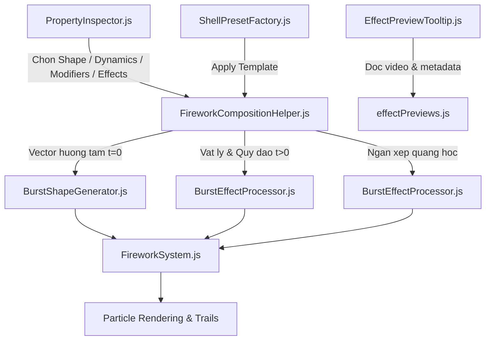

# Huong dan tao va chinh sua Phao hoa (Firework Composition Workflow)

Tai lieu nay cung cap ban do kien truc va quy trinh chuan de lap trinh vien hoac AI Agent them moi Hinh dang (Shape), Dong luc hoc no (Dynamics), Bo bo tro (Modifiers), Hieu ung quang hoc (Visual Effects) hoac Mau khoi dong nhanh (Preset Templates) theo dung mo hinh Component-based Composition, dong thoi tich hop he thong Video Preview Tooltip.

---

## 1. Ban do Kien truc Composition (Composition Architecture Map)

He thong phao hoa hoat dong theo nguyen ly tach biet trach nhiem (Decoupled Components):


```mermaid
graph TD
    UI[PropertyInspector.js] -->|Chon Shape / Dynamics / Modifiers / Effects| COMP[FireworkCompositionHelper.js]
    PRESET[ShellPresetFactory.js] -->|Apply Template| COMP
    COMP -->|Vector huong tam t=0| SHAPE[BurstShapeGenerator.js]
    COMP -->|Vat ly & Quy dao t>0| DYN[BurstEffectProcessor.js]
    COMP -->|Ngan xep quang hoc| EFF[BurstEffectProcessor.js]
    SHAPE --> SYS[FireworkSystem.js]
    DYN --> SYS
    EFF --> SYS
    SYS --> PART[Particle Rendering & Trails]
    TOOLTIP[EffectPreviewTooltip.js] -->|Doc video & metadata| PREV[effectPreviews.js]
```

### Cac tep tin chiu trach nhiem chinh:

1. **Quan ly Taxonomy & Templates:**
   - [FireworkCompositionHelper.js](../../src/factories/FireworkCompositionHelper.js): Trung tam quan ly danh muc `AVAILABLE_SHAPES`, `AVAILABLE_DYNAMICS`, `AVAILABLE_MODIFIERS`, `AVAILABLE_EFFECT_TAGS` va `PRESET_TEMPLATES`.
2. **Hinh hoc khong gian (Shape - t = 0):**
   - [BurstShapeGenerator.js](../../src/factories/BurstShapeGenerator.js): Tinh toan vector huong tam 3D ban dau cua cac hat. Tuyet doi khong chua logic vat ly hay hieu ung dong.
3. **Dong luc hoc & Vat ly hat (Dynamics - t > 0):**
   - [BurstEffectProcessor.js](../../src/factories/BurstEffectProcessor.js): Dieu khien van toc, ma sat khong khi, trong luc rieng biet (vi du: flow, willow, falling-leaves, snow, wave, galaxy-spin, bouquet-comet).
4. **Hieu ung quang hoc (Visual Effects):**
   - [BurstEffectProcessor.js](../../src/factories/BurstEffectProcessor.js): Xu ly nhap nhay (strobe, white-strobe, glitter-strobe), no lach tach (crackle), an hien (ghost), vet sang (trail).
5. **Giao dien bien tap & Khoi dong nhanh (UI & Preset Factory):**
   - [PropertyInspector.js](../../src/ui/PropertyInspector.js): Render cac dropdown doc lap cho Shape, Dynamics va tag chips cho Visual Effects.
   - [ShellPresetFactory.js](../../src/factories/ShellPresetFactory.js): Khai bao preset khoi dong nhanh.
6. **Cau hinh Video Preview & Danh muc minh hoa:**
   - [src/config/effectPreviews.js](../../src/config/effectPreviews.js): Khai bao metadata, the phan loai (tags), tieu de va duong dan video preview cho tung hieu ung.
   - [docs/FIREWORK_PREVIEW_RECORDING_LIST.md](../../docs/FIREWORK_PREVIEW_RECORDING_LIST.md): Danh sach kiem tra va huong dan thong so quay video mau.
7. **Da ngon ngu (Internationalization):**
   - [src/config/lang/](../../src/config/lang/): `en.js`, `vi.js`, `zh.js`, `ja.js`.

---

## 2. Bieu mau huong dan lap trinh (Step-by-Step Guides)

### A. Them mot Hinh dang moi (New Shape)

1. **Buoc 1:** Them ten shape vao `AVAILABLE_SHAPES` trong [FireworkCompositionHelper.js](../../src/factories/FireworkCompositionHelper.js).
2. **Buoc 2:** Dang ky shape trong `resolveShape(shellType)` cua [BurstShapeGenerator.js](../../src/factories/BurstShapeGenerator.js).
3. **Buoc 3:** Viet logic tinh vector 3D trong `direction(...)` cua [BurstShapeGenerator.js](../../src/factories/BurstShapeGenerator.js):
   ```javascript
   if (shape === 'my-shape') {
     const x = Math.cos(angle) * 1.0;
     const y = Math.sin(angle) * 1.0;
     const z = (Math.random() - 0.5) * 0.2;
     return new THREE.Vector3(x, y, z).normalize();
   }
   ```
4. **Buoc 4:** Khai bao he so hat trong `SHAPE_MULTIPLIERS` tai [src/config/fireworks.js](../../src/config/fireworks.js).
5. **Buoc 5:** Them ban dich ten shape vao `options.shapeType` trong ca 4 file ngon ngu (`en.js`, `vi.js`, `zh.js`, `ja.js`).
6. **Buoc 6 (Dang ky Video Preview):**
   - Khai bao metadata va duong dan `previews/shapes/<shape-name>.mp4` trong [src/config/effectPreviews.js](../../src/config/effectPreviews.js).
   - Them muc kiem tra vao bang Shape trong [docs/FIREWORK_PREVIEW_RECORDING_LIST.md](../../docs/FIREWORK_PREVIEW_RECORDING_LIST.md).
7. **Buoc 7 (Thong bao & Yeu cau nguoi dung):**
   - Thong bao cho nguoi dung duong dan file video can dat vao: `./public/previews/shapes/<shape-name>.mp4`.
   - Huong dan nguoi dung sau khi copy video vao thi chay `npm run media:mute-previews` de tu dong xoa audio track va toi uu hoa web streaming.

---

### B. Them mot Dong luc hoc moi (New Dynamics)

1. **Buoc 1:** Them ten dynamics vao `AVAILABLE_DYNAMICS` trong [FireworkCompositionHelper.js](../../src/factories/FireworkCompositionHelper.js).
2. **Buoc 2:** Dang ky ten dynamics vao `SUPPORTED_EFFECTS` va viet strategy trong [BurstEffectProcessor.js](../../src/factories/BurstEffectProcessor.js):
   ```javascript
   BurstEffectProcessor.registerEffect('my-dynamics', {
     updateVelocity(velocity, index, deltaTime, age, maxLife, effectState) {
       velocity.y += Math.sin(age * 4) * 0.02;
       velocity.multiplyScalar(0.995);
       return {
         gravityScale: 0.15,
         spawnTrail: true,
         trailLife: 0.4,
         trailIntensity: 0.5
       };
     }
   });
   ```
3. **Buoc 3:** Khai bao he so hat trong `EFFECT_MULTIPLIERS` tai [src/config/fireworks.js](../../src/config/fireworks.js).
4. **Buoc 4:** Them ban dich vao `options.dynamicsType` trong ca 4 file ngon ngu (`en.js`, `vi.js`, `zh.js`, `ja.js`).
5. **Buoc 5 (Dang ky Video Preview):**
   - Khai bao metadata va duong dan `previews/dynamics/<dynamics-name>.mp4` trong [src/config/effectPreviews.js](../../src/config/effectPreviews.js).
   - Them muc kiem tra vao bang Dynamics trong [docs/FIREWORK_PREVIEW_RECORDING_LIST.md](../../docs/FIREWORK_PREVIEW_RECORDING_LIST.md).
6. **Buoc 6 (Thong bao & Yeu cau nguoi dung):**
   - Thong bao cho nguoi dung duong dan file video can dat vao: `./public/previews/dynamics/<dynamics-name>.mp4`.
   - Huong dan nguoi dung chay `npm run media:mute-previews` sau khi them file.

---

### C. Them mot Hieu ung quang hoc moi (New Visual Effect Tag)

1. **Buoc 1:** Them tag vao `AVAILABLE_EFFECT_TAGS` trong [FireworkCompositionHelper.js](../../src/factories/FireworkCompositionHelper.js) va [PropertyInspector.js](../../src/ui/PropertyInspector.js).
2. **Buoc 2:** Xu ly co hieu ung trong `initialize(...)` va `updateVelocity(...)` cua [BurstEffectProcessor.js](../../src/factories/BurstEffectProcessor.js).
3. **Buoc 3:** Them ban dich ten effect vao `fields` trong ca 4 file ngon ngu (`en.js`, `vi.js`, `zh.js`, `ja.js`).
4. **Buoc 4 (Dang ky Video Preview):**
   - Khai bao metadata va duong dan `previews/effects/<effect-name>.mp4` trong [src/config/effectPreviews.js](../../src/config/effectPreviews.js).
   - Them muc kiem tra vao bang Effects trong [docs/FIREWORK_PREVIEW_RECORDING_LIST.md](../../docs/FIREWORK_PREVIEW_RECORDING_LIST.md).
5. **Buoc 5 (Thong bao & Yeu cau nguoi dung):**
   - Thong bao cho nguoi dung duong dan file video can dat vao: `./public/previews/effects/<effect-name>.mp4`.
   - Nhac nguoi dung chay `npm run media:mute-previews` de xu ly mute audio.

---

### D. Dang ky mot Preset / Quick Template moi

1. **Buoc 1:** Them template vao `PRESET_TEMPLATES` trong [FireworkCompositionHelper.js](../../src/factories/FireworkCompositionHelper.js):
   ```javascript
   myNewPreset: {
     shape: 'heart',
     dynamics: 'flow',
     modifiers: { pistil: false, instantBurst: false },
     effects: ['strobe', 'crackle']
   }
   ```
2. **Buoc 2:** Dang ky preset vao `presetMenuEntries` va `presetsRegistry` trong [ShellPresetFactory.js](../../src/factories/ShellPresetFactory.js).
3. **Buoc 3:** Them ban dich ten preset vao `options.preset` trong cac file ngon ngu.
4. **Buoc 4 (Dang ky Video Preview):**
   - Khai bao metadata va duong dan `previews/presets/<preset-name>.mp4` trong [src/config/effectPreviews.js](../../src/config/effectPreviews.js).
   - Them muc kiem tra vao bang Presets trong [docs/FIREWORK_PREVIEW_RECORDING_LIST.md](../../docs/FIREWORK_PREVIEW_RECORDING_LIST.md).
5. **Buoc 5 (Thong bao & Yeu cau nguoi dung):**
   - Thong bao cho nguoi dung duong dan file video can dat vao: `./public/previews/presets/<preset-name>.mp4`.
   - Huong dan nguoi dung chay `npm run media:mute-previews`.

---

## 3. Quy dinh Thu muc Video Preview (Video Preview Directory Rules)

Moi loai phao hoa co thu muc luu tru video minh hoa rieng biet trong `./public/previews/`:

| Loai phan tu | Thu muc luu tru video | Dinh dang ten file | Vi du |
| :--- | :--- | :--- | :--- |
| **Shape** | `./public/previews/shapes/` | `<shape-name>.mp4` | `./public/previews/shapes/heart.mp4` |
| **Dynamics** | `./public/previews/dynamics/` | `<dynamics-name>.mp4` | `./public/previews/dynamics/willow.mp4` |
| **Effects & Modifiers** | `./public/previews/effects/` | `<effect-name>.mp4` | `./public/previews/effects/strobe.mp4` |
| **Presets** | `./public/previews/presets/` | `<preset-name>.mp4` | `./public/previews/presets/crown-kamuro.mp4` |

---

## 4. Nguyen tac bat buoc (Enforced Rules)

- **Khong pha vo Composition**: Khong duoc dua logic Dynamics vao Shape hoac hard-code Shape vao Dynamics.
- **Dong bo Taxonomy & Metadata**: Bat ky thanh phan moi nao cung phai duoc cap nhat vao `FireworkCompositionHelper.js`, tu dien da ngon ngu va `src/config/effectPreviews.js`.
- **Thong bao duong dan video**: Luon ghi ro duong dan thu muc video tuong ung va huong dan nguoi dung tu bo sung file video mau kem lenh `npm run media:mute-previews`.
- **Khong dung Icons/Emojis**: Giu toan bo ma nguon, comment, giao dien va tai lieu thuan van ban (text-only).
