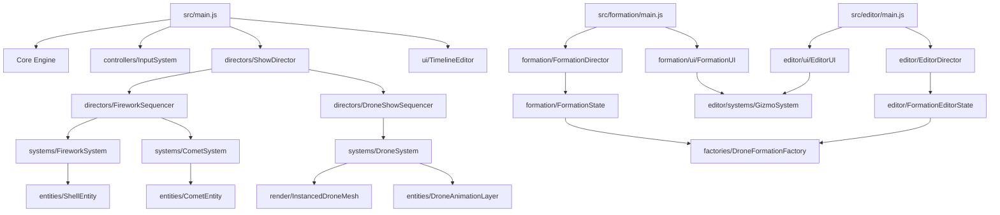

# STRUCTURE-dev.md

## 1. Logical Modules

### Core Engine
- **`src/core/SceneManager.js`**: Sets up the Three.js scene environment, starry background, moon reference, atmospheric lighting, and ground grids.
  - `SceneManager.addLaunchPad()`: Configures a red ring-based visual aid overlay for firework launch limits.
  - `SceneManager.addBurstHeightGuides()`: Draws horizontal boundary rings to represent maximum and minimum explosion heights.
  - `SceneManager.addCheckerboardFloor()`: Constructs a custom noise-textured checkerboard floor reflecting ambient atmospheric light.
- **`src/core/CameraManager.js`**: Configures the perspective camera parameters, initial viewer positions, and window resize listeners.
  - `CameraManager.onResize()`: Adjusts the camera aspect ratio and updates the projection matrix dynamically on window resize.
- **`src/core/Renderer.js`**: Initializes the WebGLRenderer with high-fidelity tone mapping, shadow support, and viewport dimension sync.
  - `Renderer.addResizeListener(callback)`: Registers callback functions to execute on window resize.
  - `Renderer.render(scene, camera)`: Flushes the scene tree rendering onto the screen canvas.
- **`src/core/Clock.js`**: Standardizes time tracking delta, keeping frame updates independent of display refresh rates.
  - `Clock.update()`: Computes the time elapsed since the last frame tick.
- **`src/core/PerformanceMonitor.js`**: Integrates standard stats overlays for measuring framerates and hardware performance zones.
  - `PerformanceMonitor.update(deltaTime)`: Triggers stats updates and performance metric computations.
- **`src/core/PostProcessingPipeline.js`**: Configures post-processing shaders, specifically anti-aliasing and atmospheric Bloom overlays.
  - `PostProcessingPipeline.setSize(width, height, pixelRatio)`: Resizes post-processing passes when screen dimensions change.
  - `PostProcessingPipeline.render()`: Processes active graphic shaders in sequence and renders to the screen.

### Entity Models
- **`src/entities/ShellEntity.js`**: Defines the physical properties of a launched firework shell (coordinates, velocity, color, burst height, preset key, age).
- **`src/entities/CometEntity.js`**: Encapsulates data for low-altitude trail comets.
- **`src/entities/DroneEntity.js`**: Standard OOP model for singular drone objects; largely bypassed in high-performance rendering.
- **`src/entities/DroneMotionProfile.js`**: Physics parameters configuration (max velocity, steering forces) for autonomous drone behaviors.
- **`src/entities/DroneAnimationLayer.js`**: Dynamic animation layer attached to a drone entity for scaling, spinning, and shimmering effects.
  - `DroneAnimationLayer.applyAnimation(type, params, duration)`: Adds a new active procedural animation (spin, pulse, shimmer).
  - `DroneAnimationLayer.clearAnimations()`: Clears all active animations and resets the drone's scale, rotation, and intensity.
  - `DroneAnimationLayer.update(deltaTime)`: Updates ages of active animations, accumulates rotations/scales, and cleans up expired ones.

### Factories & Generators
- **`src/factories/ShellPresetFactory.js`**: Maps unique visual keys to complex firework preset behaviors and validation routines.
  - `ShellPresetFactory.randomPreset()`: Generates a completely randomized firework parameter set.
  - `ShellPresetFactory.getPresetMenuEntries()`: Returns an array of keys representing all available firework types.
  - `ShellPresetFactory.createPresetByKey(key)`: Instantiates a specific firework preset structure.
  - `ShellPresetFactory.validatePreset(preset)`: Validates presets to prevent runtime crashes.
- **`src/factories/BurstShapeGenerator.js`**: Contains pure mathematical functions to compute 3D directional vectors for explosion geometries (Sphere, Willow, Heart, Ring).
  - `BurstShapeGenerator.generate(shapeName, count, preset)`: Outputs an array of vector coordinates mapping the explosion shape.
- **`src/factories/BurstEffectProcessor.js`**: Modifies velocities and colors of fading particles to simulate micro-effects (Strobe, Crackle, Waves).
  - `BurstEffectProcessor.apply(effectType, velocity, age, color, params)`: Transforms particle attributes dynamically based on its active effects.
- **`src/factories/DroneFormationFactory.js`**: Procedural generator for 3D drone shapes (grid, circle, sphere, cube, wave, text, star, cylinder) with random jitter offsets.
  - `DroneFormationFactory.createFormation(type, count, params)`: Factory router to invoke the correct shape generator.
  - `DroneFormationFactory.circle(count, params)`, `grid(...)`, `line(...)`, `wave(...)`, `sphere(...)`, `cube(...)`, `cylinder(...)`, `star(...)`, `text(...)`: Generate mathematical coordinates.
  - `DroneFormationFactory.addVariation(positions, variation)`: Adds random jitter offset to generated coordinates.
- **`src/factories/DronePropertyFactory.js`**: Applies color and LED state logic to drone meshes based on group index mappings.
  - `DronePropertyFactory.assignColors(positions, colors, colorRule)`: Computes visual gradients or patterns for a set of drone positions.

### Systems (ECS)
- **`src/systems/FireworkSystem.js`**: Core system running each frame to spawn, move, and burst shells.
  - `FireworkSystem.launchRandom(preset, options)`: Resolves randomized coordinates and velocities to launch a shell.
  - `FireworkSystem.createShell(position, velocity, burstHeight, color, preset, shellId)`: Spawns a physical `ShellEntity` in the active array.
  - `FireworkSystem.createBurst(position, color, shape, preset)`: Triggers shell explosion and spawns individual glowing burst stars.
  - `FireworkSystem.update(deltaTime)`: Frame updates for shell trajectory and burst fading.
  - `FireworkSystem.clear()`, `burstAll()`: Utilities to reset system state.
- **`src/systems/CometSystem.js`**: Drives comet entity updates, drawing low-altitude streaks and handling instant detonations.
  - `CometSystem.launchRandom(preset, options)`: Initiates a comet launch sequence.
  - `CometSystem.update(deltaTime)`: Updates physics coordinates of comets and manages trails.
- **`src/systems/TrailSystem.js`**: Optimizes particle system draw calls to draw glowing physics trails behind flying entities.
  - `TrailSystem.spawnTrailParticle(position, color)`: Emits a small trail spark into the active buffer.
  - `TrailSystem.update(deltaTime)`: Fades and ages active trail sparks.
- **`src/systems/SmokeSystem.js`**: Spawns atmospheric particle clouds at launch nodes and explosion epicenters.
  - `SmokeSystem.spawnPuff(origin, velocity, options)`: Creates standard grey smoke particles.
  - `SmokeSystem.update(deltaTime)`: Expands, drifts, and fades smoke volume.
- **`src/systems/SkyLightReactionSystem.js`**: Briefly increases ambient light levels and flashes sky colors in sync with massive bursts.
  - `SkyLightReactionSystem.onBurst(detail)`: Registers a blast source and schedules light flashes.
  - `SkyLightReactionSystem.update(deltaTime)`: Gradually returns ambient lighting back to standard night values.
- **`src/systems/AudioSystem.js`**: Manages Web Audio API spatial triggers for liftoff whooshes and explosive pops.
  - `AudioSystem.preload()`: Pre-fetches show-critical sounds.
  - `AudioSystem.playLaunch(position)`: Plays spatialized liftoff sounds.
  - `AudioSystem.playBurst(position)`: Triggers heavy spatialized explosions.
- **`src/systems/MovementSystem.js`**: Reads controller inputs to steer the viewer camera in 3D flight.
  - `MovementSystem.update(deltaTime)`: Decelerates and moves the active perspective camera.
- **`src/systems/DroneSystem.js`**: Handles global performance zone offsets and the `InstancedDroneMesh` rendering buffer.
  - `DroneSystem.createDrones(count)`: Spawns a specified number of drone instances.
  - `DroneSystem.applyFormat(positions, formatConfig)`: Sets target coordinates and transitions colors/animations.
  - `DroneSystem.triggerAnimation(animationType, params, duration)`: Applies an animation multiplier to all managed drones.
  - `DroneSystem.update(deltaTime)`: Interpolates drones towards their targets and updates instance matrix buffers.
  - `DroneSystem.isFormationComplete()`: Checks if all drones have successfully arrived at their targets.

### Effects & Animations
- **`src/effects/arrival/ArrivalColorSystem.js`**: Handles gradual illumination when drones arrive at target positions.
  - `ArrivalColorSystem.computeDelays(drones, config)`: Computes custom light-up delay intervals (instant, sequential, or radialSpread).
  - `ArrivalColorSystem.apply(drone, config, timeSinceArrival)`: Evaluates time delay and fades the drone color in from black to target color.
- **`src/effects/transition/TransitionColorSystem.js`**: Orchestrates colors and blinking effects when drones transition between shapes.
  - `TransitionColorSystem.apply(drone, config, time)`: Applies static solid color or procedural strobe flickering to a transitioning drone.

### Static Formation Module
- **`src/formation/FormationState.js`**: Core state engine managing 3D static formations, undo/redo history, selections, groups, and clipboards.
  - `FormationState.subscribe(listener)`: Subscribes listeners to change notifications.
  - `FormationState.saveStateToHistory()`, `undo()`, `redo()`: Traverses the operation history stack.
  - `FormationState.select(index, multi)`, `deselect(index)`, `clearSelection()`, `selectGroup(groupName, multi)`: Standard selection updates.
  - `FormationState.duplicateSelected()`, `deleteSelected()`, `copyToClipboard()`, `pasteFromClipboard()`: Object manipulation commands.
- **`src/formation/FormationDirector.js`**: Master scene loop and InstancedMesh compiler for static formations. Reuses the GizmoSystem.
  - `FormationDirector.initInstancedMesh()`: Pre-allocates instanced spheres for rendering static formations.
  - `FormationDirector.onPointerDown(event)`: Casts 3D raycast to detect drone selection click events.
  - `FormationDirector.onKeyDown(event)`: Listens for keyboard shortcuts (Ctrl+Z, Ctrl+Y, Delete, Shift+C, etc.).
  - `FormationDirector.updateMeshFromState()`: Flushes positions and colors from state into Three.js matrix updates.
- **`src/formation/ui/FormationUI.js`**: Assembles the Left (Shape, Group) and Right (Gizmo, Properties) panels for static editing.
  - `setupFormationUI(state, director)`: Renders full HTML panel structures and binds callbacks.
- **`src/formation/ui/FormationShapePanel.js`**: Renders controls for mathematical shape generators (Circle, Grid, Wave, Star, Cube, etc.).
- **`src/formation/ui/FormationPropertiesPanel.js`**: Manages colors, scales, and group assignments for selected particles.

### Orchestration & Controllers
- **`src/controllers/InputSystem.js`**: Binds standard desktop mouse/keyboard events, pointer locking, and play/pause timeline shortcuts.
- **`src/directors/FireworkSequencer.js`**: Translates sequence timestamps into actual launch events.
  - `FireworkSequencer.playPattern(pattern, config)`: Triggers complex choreographies (fans, sweeps, step launches).
  - `FireworkSequencer.playFinale(totalShells, duration)`: Spawns dense arrays of randomized bursts in a short burst window.
- **`src/directors/DroneShowSequencer.js`**: High-performance interpolation engine syncing pre-calculated drone JSON steps to the global timeline.
  - `DroneShowSequencer.loadSequence(sequenceData, startTime)`: Parses JSON keyframes and pre-calculates time parameters.
  - `DroneShowSequencer.seek(time)`: Jumps timeline position and updates positions instantly.
  - `DroneShowSequencer.update(deltaTime)`: Computes current interpolation weights between keyframes and writes to DroneSystem.
- **`src/directors/ShowDirector.js`**: Master clock that reads timeline tracks, firing audio, pyro patterns, and drone sequencers in perfect synchronization.
  - `ShowDirector.loadScript(scriptConfig)`: Parses high-level show events.
  - `ShowDirector.update(deltaTime)`: Tracks clock time, fires events sequentially, and updates sequencers.

### UI & Animated Timeline Editor
- **`src/ui/TimelineEditor.js`**: Standard editor overlay containing track timelines, zoom options, event blocks, and playback controls.
- **`src/ui/PropertyInspector.js`**: Connects form inputs to event timing modifications and coordinates.
- **`src/editor/main.js`**: Entry point for the timeline-based animated formation editor.
- **`src/editor/FormationEditorState.js`**: State engine for the animated timeline-based drone editor.
  - `FormationEditorState.saveCurrentStep()`, `loadStep(index)`, `addStep()`, `removeStep(index)`: Timeline step sequence manipulation.
  - `FormationEditorState.exportFormat()`, `loadFormat(data)`: JSON import/export adapters for drone sequences.
- **`src/editor/EditorDirector.js`**: Manages animated rendering loop, input raycasting, and Three.js buffers for the animated editor.
- **`src/editor/ui/EditorUI.js`**: Assembles animated editor panels.
- **`src/editor/ui/panels/`**: Layout panels (FilePanel, ShapePanel, GizmoPanel, SelectionPanel, GroupPanel, StepPanel, TimelinePanel).
- **`src/editor/systems/GizmoSystem.js`**: 3D selection handles allowing translation, rotation, and scaling of selected particles.
  - `GizmoSystem.isHovering()`: Checks if the user's cursor is hover-interacting with any transform handle.
  - `GizmoSystem.setMode(mode)`: Switches gizmo mode between 'translate', 'rotate', and 'scale'.
  - `GizmoSystem.onStateChange()`: Synces proxy control objects with selected drone entities.

### Config
- **`src/config/launchZone.js`**: Configures angles, sectors, heights, and center positions for firework launching.
- **`src/config/droneZone.js`**: Configures bounds and physical spacing rules for drone displays.
- **`src/config/droneFormats.js`**: Declares named preset configurations containing shape types, transition styles, arrival colors, and animations.
- **`src/config/rendering.js`**: Graphic option toggles, including Bloom threshold controls.
- **`src/config/sequences/`**: Python-like script configuration storage (`demoShow.json`, `droneDemo.json`).

## 2. Entry Points
- **`src/main.js`**: Firework Show application entry point. Initializes engine core, systems, directors, and UI.
- **`src/editor/main.js`**: Animated Drone Editor application entry point.
- **`src/formation/main.js`**: Static 3D Formation Editor application entry point.

## 3. Relationship Graph

## 4. Execution Flows
- **Firework Show Initialization**: `src/main.js` -> Setup Core managers (`SceneManager`, `CameraManager`, `Renderer`) -> Spawn Pyros/Comets/Audio/Drone Systems -> Setup `ShowDirector` and Sequencers -> Load Sequence Script -> Start render loop.
- **Dynamic Drone Animation & Transition**: `DroneShowSequencer` calculates the current display elapsed time -> interpolates coordinates between adjacent keyframes -> triggers custom transition shapes -> applies `ArrivalColorSystem` or `TransitionColorSystem` effects -> applies `DroneAnimationLayer` (spinning/pulsing) offsets -> copies matrices directly to `InstancedDroneMesh`.
- **Static Formation Editing**: `src/formation/main.js` -> Load UI panels -> Add shapes via `DroneFormationFactory` -> UI modifications update `FormationState` -> Operations saved to history -> `FormationDirector` flushes matrices to Three.js `InstancedMesh`.

## 5. Cross-Module Dependencies
- **GizmoSystem**: Shared between the animated `src/editor` timeline application and the static `src/formation` application.
- **DroneFormationFactory**: Shared utility calculating all coordinate offsets for both editing suites and runtime procedural shows.
- **TrailSystem & SmokeSystem**: Tightly bound systems called by both `FireworkSystem` and `CometSystem` to generate realistic particle simulations.

## 6. Problems & Anti-patterns
- **State Engine Duplication**: `FormationState` (static) and `FormationEditorState` (animated timeline) share almost identical code patterns for copying, pasting, deleting, and selecting drones. This should be abstracted into a unified base state class.
- **Tight UI Coupling**: UI panels in `src/editor/ui/panels/` and `src/formation/ui/` write HTML strings directly inside files and reference global DOM elements. They should be modularized or built via a lightweight template system.
- **Direct Event Listeners**: Multiple systems listen for global events (like `timeline:toggle`) dispatched directly to the window, leading to potential leak points. A centralized event bus is highly recommended.
