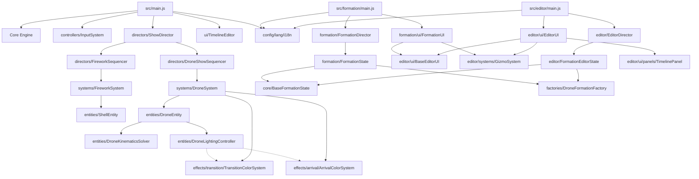

# STRUCTURE.md

## 1. Logical Modules

### Core Engine
- **`src/core/SceneManager.js`**: Sets up the Three.js scene environment, starry background, moon reference, atmospheric lighting, and ground grids.
  - `SceneManager.addLaunchPad()`: Configures a red ring-based visual aid overlay for firework launch limits.
  - `SceneManager.addBurstHeightGuides()`: Draws horizontal boundary rings to represent maximum and minimum explosion heights.
  - `SceneManager.addCheckerboardFloor()`: Constructs a custom noise-textured checkerboard floor reflecting ambient atmospheric light.
- **`src/core/CameraManager.js`**: Configures the perspective camera parameters, initial viewer positions, and window resize listeners.
  - `CameraManager.onResize()`: Adjusts the camera aspect ratio and updates the projection matrix dynamically on window resize.
- **`src/core/Renderer.js`**: Initializes the WebGLRenderer with high-fidelity tone mapping, shadow support, and viewport dimension sync.
  - `Renderer.addResizeListener(callback)`: Registers callback functions to execute on window resize.
  - `Renderer.render(scene, camera)`: Flushes the scene tree rendering onto the screen canvas.
- **`src/core/Clock.js`**: Standardizes time tracking delta, keeping frame updates independent of display refresh rates.
  - `Clock.update()`: Computes the time elapsed since the last frame tick.
- **`src/core/PerformanceMonitor.js`**: Integrates standard stats overlays for measuring framerates and hardware performance zones.
  - `PerformanceMonitor.update(deltaTime)`: Triggers stats updates and performance metric computations.
- **`src/core/PostProcessingPipeline.js`**: Configures post-processing shaders, specifically anti-aliasing and bloom overlays.
  - `PostProcessingPipeline.setSize(width, height, pixelRatio)`: Resizes post-processing passes when screen dimensions change.
  - `PostProcessingPipeline.render()`: Processes active graphic shaders in sequence and renders to the screen.
- **`src/core/BaseFormationState.js`**: Unified base state class containing core coordinates, color vectors, undo/redo history stacks, clipboard commands, and line constraints.
  - `BaseFormationState.subscribe(listener)`: Registers change listeners to receive state notifications.
  - `BaseFormationState.saveStateToHistory()`: Takes a deep snapshot of current selections, positions, and constraints.
  - `BaseFormationState.undo()`, `BaseFormationState.redo()`: Traverses the undo and redo history stack of edits.
  - `BaseFormationState.updateLineConstraints()`: Automatically lerps intermediate nodes based on persistent 2-point line boundaries.
- **`src/core/EventBus.js`**: Unified pub/sub event bus supporting communication across multiple systems.
  - `EventBus.on(event, callback)`: Registers an event listener callback.
  - `EventBus.off(event, callback)`: Removes an event listener callback.
  - `EventBus.emit(event, data)`: Emits an event with optional data payload.
- **`src/core/ConstraintSolver.js`**: Solves geometric constraint vectors for drone formations.
  - `ConstraintSolver.solveLineConstraints(positions, lineConstraints)`: Automatically updates intermediate nodes based on 2-point line boundaries.
  - `ConstraintSolver.adjustConstraintsOnDeletion(lineConstraints, deletedIndicesSortedDescending)`: Adjusts line constraints after drones are deleted.
- **`src/core/HistoryManager.js`**: Manages the undo/redo history state stack.
  - `HistoryManager.save(snapshot)`: Pushes a state snapshot onto the history stack.
  - `HistoryManager.undo()`: Retrieves the previous state snapshot from the stack.
  - `HistoryManager.redo()`: Retrieves the next state snapshot from the stack.
  - `HistoryManager.clear()`: Resets the history stacks.

### Entity Models
- **`src/entities/ShellEntity.js`**: Defines the physical properties of a launched firework shell (coordinates, velocity, color preset, and age).
- **`src/entities/CometEntity.js`**: Encapsulates physics data for low-altitude trail comets.
- **`src/entities/DroneEntity.js`**: Standard OOP model for singular drone objects, representing data state.
  - `DroneEntity.update(deltaTime, transitionSystem, arrivalSystem)`: Delegates motion physics solver and lighting controller updates.
- **`src/entities/DroneKinematicsSolver.js`**: Pure physics kinematics solver for steering forces, damping, target arrivals, and wind/flight oscillations.
  - `DroneKinematicsSolver.solve(drone, deltaTime)`: Solves and updates drone velocity and position vectors.
- **`src/entities/DroneLightingController.js`**: Decoupled LED color transition and visual animation controller.
  - `DroneLightingController.update(drone, deltaTime, transitionSystem, arrivalSystem)`: Calculates active LED color transitions, blink rates, and pulsing glow effects.
- **`src/entities/DroneMotionProfile.js`**: Configures physics parameters like steering force for autonomous drone behaviors.
- **`src/entities/DroneAnimationLayer.js`**: Dynamic animation layer attached to a drone entity for scaling, spinning, and shimmering effects.
  - `DroneAnimationLayer.applyAnimation(type, params, duration)`: Adds a new active procedural animation (spin, pulse, shimmer).
  - `DroneAnimationLayer.clearAnimations()`: Clears all active animations and resets the drone's scale, rotation, and intensity.
  - `DroneAnimationLayer.update(deltaTime)`: Updates ages of active animations, accumulates rotations/scales, and cleans up expired ones.

### Factories & Generators
- **`src/factories/ShellPresetFactory.js`**: Maps unique visual keys to complex firework preset behaviors and validation routines.
  - `ShellPresetFactory.randomPreset()`: Generates a completely randomized firework parameter set.
  - `ShellPresetFactory.createPresetByKey(key)`: Instantiates a specific firework preset structure.
- **`src/factories/BurstShapeGenerator.js`**: Contains pure mathematical functions to compute 3D directional vectors for explosion geometries (Sphere, Willow, Heart, Ring).
  - `BurstShapeGenerator.generate(shapeName, count, preset)`: Outputs an array of vector coordinates mapping the explosion shape.
- **`src/factories/BurstEffectProcessor.js`**: Modifies velocities and colors of fading particles to simulate micro-effects (Strobe, Crackle, Waves).
  - `BurstEffectProcessor.apply(effectType, velocity, age, color, params)`: Transforms particle attributes dynamically based on its active effects.
- **`src/factories/DroneFormationFactory.js`**: Dynamic factory registry that generates 3D drone shape coordinate arrays (grid, circle, sphere, cube, wave, text, star, cylinder) with dynamic custom registration.
  - `DroneFormationFactory.registerFormation(type, generatorFn)`: Registers new custom geometry shape generators.
  - `DroneFormationFactory.createFormation(type, count, params)`: Looks up and executes a shape generator from the registry.
- **`src/factories/DronePropertyFactory.js`**: Applies color and LED state logic to drone meshes based on group index mappings.
  - `DronePropertyFactory.assignColors(positions, colors, colorRule)`: Computes visual gradients or patterns for a set of drone positions.

### Systems (ECS)
- **`src/systems/FireworkSystem.js`**: Core system running each frame to spawn, move, and burst firework shells.
  - `FireworkSystem.launchRandom(preset, options)`: Resolves randomized coordinates and velocities to launch a shell.
  - `FireworkSystem.createBurst(position, color, shape, preset)`: Triggers shell explosion and spawns individual glowing burst stars.
  - `FireworkSystem.update(deltaTime)`: Frame updates for shell trajectory and burst fading.
- **`src/systems/CometSystem.js`**: Drives comet entity updates, drawing low-altitude streaks and handling instant detonations.
- **`src/systems/TrailSystem.js`**: Optimizes particle system draw calls to draw glowing physics trails behind flying entities.
- **`src/systems/SmokeSystem.js`**: Spawns atmospheric particle clouds at launch nodes and explosion epicenters.
- **`src/systems/SkyLightReactionSystem.js`**: Briefly increases ambient light levels and flashes sky colors in sync with massive explosions.
- **`src/systems/AudioSystem.js`**: Manages Web Audio API spatial triggers for liftoff whooshes and explosive pops.
- **`src/systems/MovementSystem.js`**: Reads keyboard controller inputs to steer the viewer camera in 3D flight.
- **`src/systems/DroneSystem.js`**: Handles global performance zone offsets, instanced rendering, and updates drone attributes.
  - `DroneSystem.update(deltaTime)`: Updates drone parameters (injecting TransitionColorSystem and ArrivalColorSystem) and flushes instance matrix buffers.
- **`src/systems/PhysicSystem.js`**: Placeholder for physics-related drone coordinate simulations.

### Effects & Animations
- **`src/effects/arrival/ArrivalColorSystem.js`**: Handles gradual illumination when drones arrive at target positions.
- **`src/effects/transition/TransitionColorSystem.js`**: Orchestrates colors and blinking effects when drones transition between shapes.

### Multi-Language i18n Module
- **`src/config/lang/i18n.js`**: The translation manager executing in both Electron backend and Vite frontend, handling locale lookup and system detection.
  - `t(key, params)`: Looks up translation values recursively from dictionaries, supporting dynamic interpolation.
  - `getLanguage()`, `setLanguage(lang)`: Manages current language state and saves preference persistent to localStorage.
- **`src/config/lang/en.js`, `vi.js`, `zh.js`, `ja.js`**: Dictionaries for English, Vietnamese, Simplified Chinese, and Japanese, mapping all front-end panel interfaces.

### Shared Layout & Editor UI
- **`src/editor/ui/BaseEditorUI.js`**: Reusable base editor UI helper.
  - `setupBaseEditorUI(state, director, options)`: Sets up left/right columns, handles collapsible panels, camera reset view, and Electron native language listeners.

### Static Formation Module
- **`src/formation/FormationState.js`**: Managed state subclass inheriting from `BaseFormationState` representing static drone configurations.
- **`src/formation/FormationDirector.js`**: Master scene loop and InstancedMesh compiler for static 3D formations.
- **`src/formation/ui/FormationUI.js`**: Sets up static editor left (Shape, Group) and right (Gizmo, Properties) panels using `BaseEditorUI`.
- **`src/formation/ui/FormationShapePanel.js`**: Renders forms and shape templates (Model Holograms, Reference 2D images).

### Orchestration & Controllers
- **`src/controllers/InputSystem.js`**: Binds standard desktop mouse/keyboard events, pointer locking, and play/pause timeline shortcuts.
- **`src/directors/FireworkSequencer.js`**: Translates sequence timestamps into actual launch events.
- **`src/directors/ShowDirector.js`**: Master clock that reads timeline tracks, firing audio, pyro patterns, and drone sequencers in perfect synchronization.
- **`src/directors/DroneShowSequencer.js`**: High-performance interpolation engine syncing pre-calculated drone JSON steps to the global timeline.
  - `DroneShowSequencer.seek(time)`: Jumps timeline position and updates positions instantly.
  - `DroneShowSequencer.update(deltaTime)`: Computes current interpolation weights between keyframes, applies transition light effects, and outputs colors.

### UI & Animated Timeline Editor
- **`src/ui/TimelineEditor.js`**: Standard editor overlay containing track timelines, zoom options, event blocks, and playback controls.
- **`src/ui/PropertyInspector.js`**: Connects form inputs to event timing modifications and coordinates.
- **`src/editor/main.js`**: Entry point for the timeline-based animated formation editor.
- **`src/editor/FormationEditorState.js`**: State engine for the animated timeline-based drone path editor, extending `BaseFormationState`.
- **`src/editor/EditorDirector.js`**: Manages animated rendering loops, selection raycasting, transition light computations, and Three.js matrix updates.
- **`src/editor/ui/EditorUI.js`**: Sets up animated editor left (File, Group) and right (Gizmo, Selection, Step) panels using `BaseEditorUI`.
- **`src/editor/ui/panels/TimelinePanel.js`**: Timeline step sequence view, providing native HTML5 drag-and-drop to swap step orders and recompute times.
- **`src/editor/systems/GizmoSystem.js`**: 3D selection handles allowing translation, rotation, and scaling of selected particles.

## 2. Entry Points
- **`src/main.js`**: Main show viewer entry point. Integrates audio, pyros simulation, and drone sequencers.
- **`src/editor/main.js`**: Entry point for the animated timeline-based drone path editor.
- **`src/formation/main.js`**: Entry point for the static 3D drone formation blueprint designer.

## 3. Relationship Graph

## 4. Execution Flows
- **Firework Show Playback & Sync**: `src/main.js` initializes managers -> `ShowDirector` tracks real elapsed ticks -> spawns comets, sparks, launch trails, and sound pops dynamically -> `DroneShowSequencer` calculates current chặng bay, interpolating drone paths and feeding matrix coordinate updates into `DroneSystem`.
- **Static Formation blueprinting**: `src/formation/main.js` draws UI panels using `FormationUI` -> user adds shape profiles from `DroneFormationFactory` (which processes the shape coordinates via its dynamic registry) -> modifications update positions in `FormationState` -> `FormationDirector` flushes buffers directly into Three.js matrix updates.
- **Timeline-based Animation Drag & Reorder**: In the Timeline Panel, dragging a step card stores its `index`. On `drop`, steps are reordered via `splice` directly in `state.steps` array. `state.recalculateTimes()` recalculates all timeline time intervals based on custom duration parameters -> UI is flushed and 3D simulation re-renders instantly.

## 5. Cross-Module Dependencies
- **`BaseFormationState`**: Shared core state class managing coordinates, groups, history stacks, and line constraints.
- **`ConstraintSolver`**: Shared mathematical operations to compute 3D lines constraints, used by BaseFormationState.
- **`HistoryManager`**: Shared history stack mechanism to manage undo/redo snapshots.
- **`globalEventBus`**: Centralized event system used across scene/input managers, audio/particle systems, and editors.
- **`GizmoSystem`**: Jointly shared tool between static formation editor and animated editor.
- **`BaseEditorUI`**: Shared layout framework for left/right columns, collapsible panel handling, reset view camera, and native language change events.
- **`i18n translation system`**: Imported across 15 frontend panel files and Electron configuration pipelines for complete multi-language syncing.

## 6. Problems & Anti-patterns
- **HTML-in-JS UI Panel coupling**: Frontend panels in `src/editor/ui/panels/` and `src/formation/ui/` keep hardcoded HTML structures inside Javascript strings and query standard global DOM elements. They should be refactored into modular, template-based structures. *(Note: Shared layout boilerplate, reset view, and collapsible logic were consolidated in June 2026 via `BaseEditorUI.js`)*.
