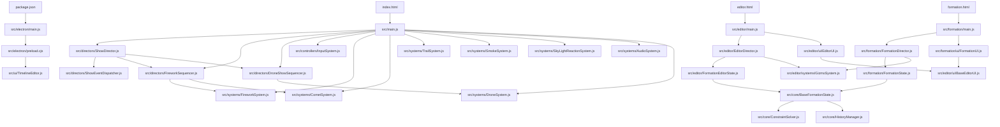

# STRUCTURE.md

## 1. Logical Modules

### Runtime Bootstraps
- **`src/main.js`**: Boots the browser show viewer, wires the core managers, show systems, sequencers, hotkeys, and the animation loop.
  - `animate()`: Advances the clock, updates active systems, and renders the current frame.
- **`src/editor/main.js`**: Boots the animated editor view and runs the editor render loop.
  - `animate()`: Advances the editor director and renders the scene each frame.
- **`src/formation/main.js`**: Boots the static formation designer and runs the formation render loop.
  - `animate()`: Advances the formation director and renders the scene each frame.
- **`src/electron/main.js`**: Owns the Electron window, app menus, IPC handlers, and screen switching.
  - `createWindow()`: Creates the BrowserWindow, menu, startup URL, and navigation guards.

### Show Orchestration
- **`src/directors/ShowDirector.js`**: Schedules timed show events, syncs audio and drone playback, and delegates event execution.
  - `loadScript(scriptConfig)`: Sorts events, resets playback, and prepares audio and drone sequences.
  - `seek(time)`: Jumps to a new playback time and resynchronizes dependent systems.
  - `play()`, `pause()`, `stop()`, `update(deltaTime)`, `executeEvent(evt)`: Control playback state and dispatch due events.
- **`src/directors/ShowEventDispatcher.js`**: Routes show event objects to the correct firework, comet, sequence, or finale handler.
  - `register(eventType, handlerFn)`: Registers a handler for a given event type.
  - `dispatch(evt, context)`: Looks up the handler for an event and executes it.
- **`src/directors/FireworkSequencer.js`**: Expands show patterns into timed firework and comet launches.
  - `playPattern(pattern, config)`: Schedules a firework pattern over time.
  - `playCometSequence(pattern, config)`: Schedules a comet sequence over time.
  - `playFinale(totalShells, duration)`: Schedules a dense closing burst.
  - `update(deltaTime)`, `clear()`: Advance or reset queued launch tasks.
- **`src/directors/DroneShowSequencer.js`**: Converts prerecorded drone steps into time-synced drone playback.
  - `loadSequence(sequenceData, startTime)`: Loads and normalizes a drone show sequence.
  - `play()`, `pause()`, `stop()`, `seek(time)`, `update(deltaTime)`: Control drone timeline playback.

### Show Systems
- **`src/systems/FireworkSystem.js`**: Manages shells, bursts, and frame-by-frame firework simulation.
- **`src/systems/CometSystem.js`**: Manages low-altitude comet launches and their updates.
- **`src/systems/TrailSystem.js`**: Owns trail particle emission and trail cleanup.
- **`src/systems/SmokeSystem.js`**: Spawns and updates smoke around launch and burst events.
- **`src/systems/SkyLightReactionSystem.js`**: Applies temporary sky and ambient light reactions to large events.
- **`src/systems/AudioSystem.js`**: Handles audio preloading, playback, and spatial response.
- **`src/systems/MovementSystem.js`**: Reads input state and moves the viewer camera.
- **`src/systems/DroneSystem.js`**: Updates drone instances, transitions, and arrival lighting.
- **`src/systems/PhysicSystem.js`**: Placeholder for additional physics simulation.

### Core Infrastructure
- **`src/core/Clock.js`**: Produces frame delta timing for all animation loops.
  - `update()`: Computes the latest frame delta.
- **`src/core/CameraManager.js`**: Owns the shared perspective camera and resize behavior.
  - `onResize()`: Updates aspect ratio and projection state.
- **`src/core/SceneManager.js`**: Builds the Three.js scene, atmosphere, and other shared scene objects.
- **`src/core/Renderer.js`**: Wraps the WebGL renderer and resize wiring.
  - `addResizeListener(callback)`: Registers a resize callback.
  - `render(scene, camera)`: Draws the current scene.
- **`src/core/PostProcessingPipeline.js`**: Configures optional post-processing passes.
  - `setSize(width, height, pixelRatio)`: Resizes the post-processing chain.
  - `render()`: Renders the active post-processing pipeline.
- **`src/core/PerformanceMonitor.js`**: Updates the performance overlay and frame statistics.
  - `update(deltaTime)`: Refreshes the monitor for the current frame.
- **`src/core/HotkeyManager.js`**: Registers and normalizes keyboard shortcuts.
- **`src/core/EventBus.js`**: Provides shared pub/sub messaging across systems.
  - `on(event, callback)`, `off(event, callback)`, `emit(event, data)`: Manage event listeners and dispatch.
- **`src/core/BaseFormationState.js`**: Shared state base for editable formation data, history, clipboard actions, and line constraints.
  - `subscribe(listener)`: Registers a state change listener.
  - `saveStateToHistory()`: Captures a snapshot for undo/redo.
  - `undo()`, `redo()`: Traverse the history stack.
  - `updateLineConstraints()`: Recomputes constrained points.
- **`src/core/ConstraintSolver.js`**: Solves line constraints for formation point sets.
  - `solveLineConstraints(positions, lineConstraints)`: Recomputes constrained points.
  - `adjustConstraintsOnDeletion(lineConstraints, deletedIndicesSortedDescending)`: Repairs constraints after deletions.
- **`src/core/HistoryManager.js`**: Stores and restores snapshot history.
  - `save(snapshot)`, `undo()`, `redo()`, `clear()`: Manage the snapshot stack.

### Data, Factories, and Renderers
- **`src/entities/ShellEntity.js`**: Represents a launched firework shell.
- **`src/entities/CometEntity.js`**: Represents a comet particle or streak.
- **`src/entities/DroneEntity.js`**: Represents one drone and its mutable state.
  - `update(deltaTime, transitionSystem, arrivalSystem)`: Advances motion and lighting state.
- **`src/entities/DroneKinematicsSolver.js`**: Computes steering and movement for drones.
  - `solve(drone, deltaTime)`: Updates the drone position and velocity.
- **`src/entities/DroneLightingController.js`**: Controls LED transitions and lighting effects for a drone.
  - `update(drone, deltaTime, transitionSystem, arrivalSystem)`: Updates the current lighting state.
- **`src/entities/DroneMotionProfile.js`**: Defines movement tuning for drone behaviors.
- **`src/entities/DroneAnimationLayer.js`**: Applies transient visual animation layers to a drone.
  - `applyAnimation(type, params, duration)`: Adds a timed animation effect.
  - `clearAnimations()`: Removes active animation effects.
  - `update(deltaTime)`: Advances and expires animation effects.
- **`src/factories/ShellPresetFactory.js`**: Creates firework preset objects for random and keyed use.
  - `randomPreset()`: Produces a randomized preset.
  - `createPresetByKey(key)`: Returns a preset by name.
- **`src/factories/BurstShapeGenerator.js`**: Generates burst direction vectors for different explosion shapes.
  - `generate(shapeName, count, preset)`: Produces the vector set for a burst shape.
- **`src/factories/BurstEffectProcessor.js`**: Applies micro-effects to burst particles.
  - `apply(effectType, velocity, age, color, params)`: Adjusts particle attributes for an effect.
- **`src/factories/DroneFormationFactory.js`**: Builds formation point sets from a registry of generators.
  - `registerFormation(type, generatorFn)`: Registers a custom formation generator.
  - `createFormation(type, count, params)`: Creates formation coordinates.
- **`src/factories/DronePropertyFactory.js`**: Assigns color and property patterns to drone positions.
  - `assignColors(positions, colors, colorRule)`: Computes colors for the given points.
- **`src/render/InstancedShellRenderer.js`**: Owns instanced shell rendering for fireworks.
- **`src/render/InstancedDroneMesh.js`**: Owns instanced mesh updates for drones.
- **`src/effects/transition/TransitionColorSystem.js`**: Computes transition lighting during drone shape changes.
- **`src/effects/arrival/ArrivalColorSystem.js`**: Computes lighting when drones reach their targets.

### Editors and Formation Modes
- **`src/editor/EditorDirector.js`**: Drives the animated editor scene, selection flow, and mesh sync.
  - `handleCanvasClick(event)`, `performBoxSelection(startX, startY, endX, endY)`, `onContextMenu(event)`, `saveDirectly()`, `updateMeshFromState()`: Handle user interaction and push state into the mesh.
- **`src/editor/FormationEditorState.js`**: Editable state model for the animated timeline editor.
- **`src/editor/ui/BaseEditorUI.js`**: Shared layout helper for the editor and formation views.
  - `setupBaseEditorUI(state, director, options)`: Builds the shared two-column editor shell.
- **`src/editor/ui/EditorUI.js`**: Assembles the animated editor panels on top of `BaseEditorUI`.
- **`src/editor/ui/panels/TimelinePanel.js`**: Handles the editor timeline step list and drag-reorder interactions.
- **`src/editor/systems/GizmoSystem.js`**: Provides transform gizmos for editor selection.
- **`src/ui/TimelineEditor.js`**: Shows the show timeline overlay, event blocks, and playback controls.
- **`src/ui/PropertyInspector.js`**: Edits event properties and timing fields in the show editor.
- **`src/formation/FormationDirector.js`**: Drives the static formation designer scene, selection, and persistence.
  - `handleCanvasClick(event)`, `performBoxSelection(startX, startY, endX, endY)`, `onContextMenu(event)`, `saveDirectly()`, `updateMeshFromState()`: Handle formation editing actions and sync the mesh.
- **`src/formation/FormationState.js`**: Editable state model for static formation design.
- **`src/formation/ui/FormationUI.js`**: Assembles the static formation panels on top of `BaseEditorUI`.
- **`src/formation/ui/FormationShapePanel.js`**: Renders shape presets and shape selection controls.
- **`src/formation/ui/FormationPropertiesPanel.js`**: Renders property controls for the formation editor.

### Localization and Runtime Config
- **`src/config/lang/i18n.js`**: Renderer-side localization store used by the UI.
  - `t(key, params)`: Looks up and interpolates translated strings.
  - `getLanguage()`, `setLanguage(lang)`: Read and change the active locale.
- **`src/config/lang/en.js`**, **`src/config/lang/vi.js`**, **`src/config/lang/zh.js`**, **`src/config/lang/ja.js`**: Locale dictionaries for the supported UI languages.
- **`src/config/rendering.js`**: Controls render-path options such as post-processing.
- **`src/config/launchZone.js`**, **`src/config/droneZone.js`**, **`src/config/droneFormats.js`**: Define runtime bounds and shape presets used by the simulation and editors.

## 2. Entry Points
- **Browser show viewer**: `index.html` loads `src/main.js`.
- **Browser animated editor**: `editor.html` loads `src/editor/main.js`.
- **Browser formation designer**: `formation.html` loads `src/formation/main.js`.
- **Electron app shell**: `package.json` points `main` to `src/electron/main.js`.
- **Renderer bridge**: `src/electron/preload.cjs` exposes `window.electronAPI` for file, sequence, and language operations.

## 3. Relationship Graph

```mermaid
graph TD
    Index[index.html] --> Main[src/main.js]
    EditorHtml[editor.html] --> EditorMain[src/editor/main.js]
    FormationHtml[formation.html] --> FormationMain[src/formation/main.js]
    ElectronPkg[package.json] --> ElectronMain[src/electron/main.js]
    ElectronMain --> Preload[src/electron/preload.cjs]
    Preload --> TimelineEditor[src/ui/TimelineEditor.js]

    Main --> ShowDirector[src/directors/ShowDirector.js]
    Main --> FireworkSeq[src/directors/FireworkSequencer.js]
    Main --> DroneSeq[src/directors/DroneShowSequencer.js]
    Main --> Input[src/controllers/InputSystem.js]
    Main --> FireworkSystem[src/systems/FireworkSystem.js]
    Main --> CometSystem[src/systems/CometSystem.js]
    Main --> TrailSystem[src/systems/TrailSystem.js]
    Main --> SmokeSystem[src/systems/SmokeSystem.js]
    Main --> SkyLight[src/systems/SkyLightReactionSystem.js]
    Main --> AudioSystem[src/systems/AudioSystem.js]
    Main --> DroneSystem[src/systems/DroneSystem.js]

    ShowDirector --> Dispatcher[src/directors/ShowEventDispatcher.js]
    ShowDirector --> FireworkSeq
    ShowDirector --> DroneSeq
    FireworkSeq --> FireworkSystem
    FireworkSeq --> CometSystem
    DroneSeq --> DroneSystem

    EditorMain --> EditorDirector[src/editor/EditorDirector.js]
    EditorMain --> EditorUI[src/editor/ui/EditorUI.js]
    EditorDirector --> EditorState[src/editor/FormationEditorState.js]
    EditorDirector --> Gizmo[src/editor/systems/GizmoSystem.js]
    EditorUI --> BaseEditorUI[src/editor/ui/BaseEditorUI.js]

    FormationMain --> FormationDirector[src/formation/FormationDirector.js]
    FormationMain --> FormationUI[src/formation/ui/FormationUI.js]
    FormationDirector --> FormationState[src/formation/FormationState.js]
    FormationDirector --> Gizmo
    FormationUI --> BaseEditorUI

    EditorState --> BaseFormationState[src/core/BaseFormationState.js]
    FormationState --> BaseFormationState
    BaseFormationState --> ConstraintSolver[src/core/ConstraintSolver.js]
    BaseFormationState --> HistoryManager[src/core/HistoryManager.js]
```

## 4. Execution Flows
- **Show viewer playback**: `index.html` loads `src/main.js`, which builds the scene, camera, renderer, audio, and show systems; `ShowDirector` advances timeline time; `ShowEventDispatcher` routes each due event to firework, comet, sequence, or finale handlers; the frame loop then updates drones, particles, smoke, sky reaction, and rendering.
- **Timeline event editing**: The show overlay in `src/ui/TimelineEditor.js` edits the current script and uses `window.electronAPI` when Electron is present; the inspector updates event fields, playback can seek, and show state is reloaded through `ShowDirector`.
- **Animated editor flow**: `src/editor/main.js` boots the editor scene; `EditorDirector` listens for canvas interaction, updates `FormationEditorState`, and writes the result back into the instanced mesh; `EditorUI` and `GizmoSystem` provide the editing surface.
- **Static formation flow**: `src/formation/main.js` boots the formation scene; `FormationDirector` coordinates selection and persistence; `FormationState` stores the edited points; `FormationUI` and `FormationShapePanel` provide shape and property controls.
- **Electron file flow**: `src/electron/main.js` owns file dialogs, sequence storage, and language switching; `src/electron/preload.cjs` exposes those IPC actions to the renderer as `window.electronAPI`.

## 5. Cross-Module Dependencies
- **`BaseFormationState`**: Shared editing state for both formation modes and the common undo/redo model.
- **`ConstraintSolver`**: Shared constraint math used by editable formation state.
- **`HistoryManager`**: Shared snapshot stack for editor and formation workflows.
- **`BaseEditorUI`**: Shared DOM shell for both editor screens, which keeps the panel layout consistent but tightly coupled to fixed page roots.
- **`EventBus`**: Hidden cross-system messaging layer used by show and simulation code.
- **`window.electronAPI`**: Renderer-side IPC bridge used by the timeline editor and language switching.
- **`i18n`**: Renderer-only localization state shared by the browser UI and Electron renderer.
- **`SceneManager`, `CameraManager`, and `Renderer`**: Shared runtime singletons that every entry point constructs and mutates.
- **`ShowDirector` + `DroneShowSequencer`**: Joint playback control path that keeps the show timeline and drone timeline in sync.

## 6. Problems & Anti-patterns
- **Duplicate editor orchestration**: `src/editor/EditorDirector.js` and `src/formation/FormationDirector.js` repeat the same selection, mesh-sync, and save patterns.
- **Implicit global bridge**: `window.electronAPI` is required for save/load and language sync, which makes renderer behavior depend on preload wiring.
- **Renderer-only localization**: `src/config/lang/i18n.js` is browser-side state but is treated like a global app service.
- **Mutable playback data**: `ShowDirector`, `ShowEventDispatcher`, and `DroneShowSequencer` all mutate loaded script objects and runtime context in place, which makes replay behavior harder to reason about.
- **Page-template coupling**: `BaseEditorUI` and the panel modules depend on fixed DOM roots instead of a reusable component boundary.
- **Overlapping timeline concepts**: `src/ui/TimelineEditor.js` and `src/editor/ui/panels/TimelinePanel.js` are distinct layers but share similar names, which makes the UI architecture easy to misread.
