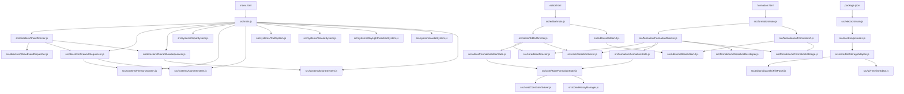

# STRUCTURE.md

## 1. Logical Modules

### Runtime Bootstraps
- **[src/main.js](./src/main.js)**: Boots the browser show viewer, wires the core managers, show systems, sequencers, hotkeys, and the animation loop.
  - `animate()`: Advances the clock, updates active systems, and renders the current frame.
- **[src/editor/main.js](./src/editor/main.js)**: Boots the animated editor view and runs the editor render loop.
  - `animate()`: Advances the editor director and renders the scene each frame.
- **[src/formation/main.js](./src/formation/main.js)**: Boots the static formation designer and runs the formation render loop.
  - `animate()`: Advances the formation director and renders the scene each frame.
- **[src/electron/main.js](./src/electron/main.js)**: Owns the Electron window, app menus, IPC handlers, and screen switching.
  - `createWindow()`: Creates the BrowserWindow, menu, startup URL, and navigation guards.

### Show Orchestration
- **[src/directors/ShowDirector.js](./src/directors/ShowDirector.js)**: Schedules timed show events, syncs audio and drone playback, and delegates event execution.
  - `loadScript(scriptConfig)`: Sorts events, resets playback, and prepares audio and drone sequences.
  - `seek(time)`: Jumps to a new playback time and resynchronizes dependent systems.
  - `play()`, `pause()`, `stop()`, `update(deltaTime)`, `executeEvent(evt)`: Control playback state and dispatch due events.
- **[src/directors/ShowEventDispatcher.js](./src/directors/ShowEventDispatcher.js)**: Routes show event objects to the correct firework, comet, sequence, or finale handler.
  - `register(eventType, handlerFn)`: Registers a handler for a given event type.
  - `dispatch(evt, context)`: Looks up the handler for an event and executes it.
- **[src/directors/FireworkSequencer.js](./src/directors/FireworkSequencer.js)**: Expands show patterns into timed firework and comet launches.
  - `playPattern(pattern, config)`: Schedules a firework pattern over time.
  - `playCometSequence(pattern, config)`: Schedules a comet sequence over time.
  - `playFinale(totalShells, duration)`: Schedules a dense closing burst.
  - `update(deltaTime)`, `clear()`: Advance or reset queued launch tasks.
- **[src/directors/DroneShowSequencer.js](./src/directors/DroneShowSequencer.js)**: Converts prerecorded drone steps into time-synced drone playback.
  - `loadSequence(sequenceData, startTime)`: Loads and normalizes a drone show sequence.
  - `play()`, `pause()`, `stop()`, `seek(time)`, `update(deltaTime)`: Control drone timeline playback.

### Show Systems
- **[src/systems/FireworkSystem.js](./src/systems/FireworkSystem.js)**: Manages shells, bursts, and frame-by-frame firework simulation.
  - `launchRandom(preset, options)`: Spawns a shell according to the chosen preset.
- **[src/systems/CometSystem.js](./src/systems/CometSystem.js)**: Manages low-altitude comet launches and their updates.
  - `launchRandom(preset, options)`: Spawns a comet trail particle.
- **[src/systems/TrailSystem.js](./src/systems/TrailSystem.js)**: Owns trail particle emission and trail cleanup.
- **[src/systems/SmokeSystem.js](./src/systems/SmokeSystem.js)**: Spawns and updates smoke around launch and burst events.
- **[src/systems/SkyLightReactionSystem.js](./src/systems/SkyLightReactionSystem.js)**: Applies temporary sky and ambient light reactions to large events.
- **[src/systems/AudioSystem.js](./src/systems/AudioSystem.js)**: Handles audio preloading, playback, and spatial response.
  - `preload()`: Downloads and caches audio files for show playback.
- **[src/systems/MovementSystem.js](./src/systems/MovementSystem.js)**: Reads input state and moves the viewer camera.
- **[src/systems/DroneSystem.js](./src/systems/DroneSystem.js)**: Updates drone instances, transitions, and arrival lighting.
- **[src/systems/PhysicSystem.js](./src/systems/PhysicSystem.js)**: Placeholder for additional physics simulation.
- **[src/systems/InputSystem.js](./src/systems/InputSystem.js)**: Owns the viewer input bindings, spectator camera controls, and the pause menu overlay.
  - `getSelectedPreset()`: Resolves the selected preset object from the UI dropdown choice.
  - `pause()`: Halts viewer movement and exhibits the firework selector menu.
  - `resume()`: Unblocks camera movements and hides the selector menu.

### Core Infrastructure
- **[src/core/Clock.js](./src/core/Clock.js)**: Produces frame delta timing for all animation loops.
  - `update()`: Computes the latest frame delta.
- **[src/core/CameraManager.js](./src/core/CameraManager.js)**: Owns the shared perspective camera and resize behavior.
  - `onResize()`: Updates aspect ratio and projection state.
- **[src/core/SceneManager.js](./src/core/SceneManager.js)**: Builds the Three.js scene, atmosphere, and other shared scene objects.
- **[src/core/Renderer.js](./src/core/Renderer.js)**: Wraps the WebGL renderer and resize wiring.
  - `addResizeListener(callback)`: Registers a resize callback.
  - `render(scene, camera)`: Draws the current scene.
- **[src/core/PostProcessingPipeline.js](./src/core/PostProcessingPipeline.js)**: Configures optional post-processing passes.
  - `setSize(width, height, pixelRatio)`: Resizes the post-processing chain.
  - `render()`: Renders the active post-processing pipeline.
- **[src/core/PerformanceMonitor.js](./src/core/PerformanceMonitor.js)**: Updates the performance overlay and frame statistics.
  - `update(deltaTime)`: Refreshes the monitor for the current frame.
- **[src/core/HotkeyManager.js](./src/core/HotkeyManager.js)**: Registers and normalizes keyboard shortcuts.
- **[src/core/EventBus.js](./src/core/EventBus.js)**: Provides shared pub/sub messaging across systems.
  - `on(event, callback)`, `off(event, callback)`, `emit(event, data)`: Manage event listeners and dispatch.
- **[src/core/BaseDirector.js](./src/core/BaseDirector.js)**: Serves as a base class containing common setup, instanced meshes, and camera helpers for directors.
  - `initCommon()`: Initializes shared controls, gizmos, hotkeys, and selection boxes.
  - `initInstancedMesh()`: Creates the common Three.js sphere instanced mesh for rendering.
  - `updateMeshFromState()`: Copies drone coordinate sets to the instanced mesh transformation matrix.
- **[src/core/BaseFormationState.js](./src/core/BaseFormationState.js)**: Shared state base for editable formation data, history, clipboard actions, and line constraints.
  - `subscribe(listener)`: Registers a state change listener.
  - `saveStateToHistory()`: Captures a snapshot for undo/redo.
  - `undo()`, `redo()`: Traverse the history stack.
  - `updateLineConstraints()`: Recomputes constrained points.
- **[src/core/ConstraintSolver.js](./src/core/ConstraintSolver.js)**: Solves line constraints for formation point sets.
  - `solveLineConstraints(positions, lineConstraints)`: Recomputes constrained points.
  - `adjustConstraintsOnDeletion(lineConstraints, deletedIndicesSortedDescending)`: Repairs constraints after deletions.
- **[src/core/HistoryManager.js](./src/core/HistoryManager.js)**: Stores and restores snapshot history.
  - `save(snapshot)`, `undo()`, `redo()`, `clear()`: Manage the snapshot stack.
- **[src/core/SelectionSolver.js](./src/core/SelectionSolver.js)**: Solves screen marquee box and click selections for the editors.
  - `solveBoxSelection(params)`: Projects 3D drone positions to 2D coordinates to identify marquee intersects.
  - `solveClickSelection(params)`: Evaluates raycast hits to assign individual or group selections.
- **[src/core/FileStorageAdapter.js](./src/core/FileStorageAdapter.js)**: Acts as a bridge to delegate file reads and writes to Electron IPC or falls back to Web APIs and local storage.
  - `listSequences()`: Reads sequence lists from the storage adapter.
  - `saveSequence(filename, content)`: Saves show content to disk or storage.
  - `openFileDialog()`: Displays a native open dialog and reads content.
  - `saveFileDialog(content, defaultName)`: Triggers a save-as download dialog.

### Data, Factories, and Renderers
- **[src/entities/ShellEntity.js](./src/entities/ShellEntity.js)**: Represents a launched firework shell.
- **[src/entities/CometEntity.js](./src/entities/CometEntity.js)**: Represents a comet particle or streak.
- **[src/entities/DroneEntity.js](./src/entities/DroneEntity.js)**: Represents one drone and its mutable state.
  - `update(deltaTime, transitionSystem, arrivalSystem)`: Advances motion and lighting state.
- **[src/entities/DroneKinematicsSolver.js](./src/entities/DroneKinematicsSolver.js)**: Computes steering and movement for drones.
  - `solve(drone, deltaTime)`: Updates the drone position and velocity.
- **[src/entities/DroneLightingController.js](./src/entities/DroneLightingController.js)**: Controls LED transitions and lighting effects for a drone.
  - `update(drone, deltaTime, transitionSystem, arrivalSystem)`: Updates the current lighting state.
- **[src/entities/DroneMotionProfile.js](./src/entities/DroneMotionProfile.js)**: Defines movement tuning for drone behaviors.
- **[src/entities/DroneAnimationLayer.js](./src/entities/DroneAnimationLayer.js)**: Applies transient visual animation layers to a drone.
  - `applyAnimation(type, params, duration)`: Adds a timed animation effect.
  - `clearAnimations()`: Removes active animation effects.
  - `update(deltaTime)`: Advances and expires animation effects.
- **[src/factories/ShellPresetFactory.js](./src/factories/ShellPresetFactory.js)**: Creates firework preset objects for random and keyed use.
  - `randomPreset()`: Produces a randomized preset.
  - `createPresetByKey(key)`: Returns a preset by name.
- **[src/factories/BurstShapeGenerator.js](./src/factories/BurstShapeGenerator.js)**: Generates burst direction vectors for different explosion shapes.
  - `generate(shapeName, count, preset)`: Produces the vector set for a burst shape.
- **[src/factories/BurstEffectProcessor.js](./src/factories/BurstEffectProcessor.js)**: Applies micro-effects to burst particles.
  - `apply(effectType, velocity, age, color, params)`: Adjusts particle attributes for an effect.
- **[src/factories/DroneFormationFactory.js](./src/factories/DroneFormationFactory.js)**: Builds formation point sets from a registry of generators.
  - `registerFormation(type, generatorFn)`: Registers a custom formation generator.
  - `createFormation(type, count, params)`: Creates formation coordinates.
- **[src/factories/DronePropertyFactory.js](./src/factories/DronePropertyFactory.js)**: Assigns color and property patterns to drone positions.
  - `assignColors(positions, colors, colorRule)`: Computes colors for the given points.
- **[src/render/InstancedShellRenderer.js](./src/render/InstancedShellRenderer.js)**: Owns instanced shell rendering for fireworks.
- **[src/render/InstancedDroneMesh.js](./src/render/InstancedDroneMesh.js)**: Owns instanced mesh updates for drones.
- **[src/effects/transition/TransitionColorSystem.js](./src/effects/transition/TransitionColorSystem.js)**: Computes transition lighting during drone shape changes.
- **[src/effects/arrival/ArrivalColorSystem.js](./src/effects/arrival/ArrivalColorSystem.js)**: Computes lighting when drones reach their targets.

### Editors and Formation Modes
- **[src/editor/EditorDirector.js](./src/editor/EditorDirector.js)**: Drives the animated editor scene, selection flow, and mesh sync.
  - `handleCanvasClick(event)`, `performBoxSelection(startX, startY, endX, endY)`, `onContextMenu(event)`, `saveDirectly()`, `updateMeshFromState()`: Handle user interaction and push state into the mesh.
- **[src/editor/FormationEditorState.js](./src/editor/FormationEditorState.js)**: Editable state model for the animated timeline editor.
- **[src/editor/ui/BaseEditorUI.js](./src/editor/ui/BaseEditorUI.js)**: Shared layout helper for the editor and formation views.
  - `setupBaseEditorUI(state, director, options)`: Builds the shared two-column editor shell.
- **[src/editor/ui/EditorUI.js](./src/editor/ui/EditorUI.js)**: Assembles the animated editor panels on top of `BaseEditorUI`.
- **[src/editor/ui/panels/TimelinePanel.js](./src/editor/ui/panels/TimelinePanel.js)**: Handles the editor timeline step list and drag-reorder interactions.
- **[src/editor/ui/panels/FilePanel.js](./src/editor/ui/panels/FilePanel.js)**: Setup UI controls for timeline importing and exporting.
- **[src/editor/ui/panels/GizmoPanel.js](./src/editor/ui/panels/GizmoPanel.js)**: Setup transform tools switcher buttons.
- **[src/editor/ui/panels/GroupPanel.js](./src/editor/ui/panels/GroupPanel.js)**: Configures group selections, mapping, and colors.
- **[src/editor/ui/panels/SelectionPanel.js](./src/editor/ui/panels/SelectionPanel.js)**: Wires the coordinate alignment, projection, inversion and spacing operations.
- **[src/editor/ui/panels/ShapePanel.js](./src/editor/ui/panels/ShapePanel.js)**: Manages interactive shape placement and sizing configuration.
- **[src/editor/ui/panels/StepPanel.js](./src/editor/ui/panels/StepPanel.js)**: Edits transition duration and speed profiles.
- **[src/editor/ui/templates/EditorTemplates.js](./src/editor/ui/templates/EditorTemplates.js)**: Holds standard HTML panel render templates.
- **[src/editor/ui/utils/Modal.js](./src/editor/ui/utils/Modal.js)**: Displays custom layout alert and confirm dialogs.
- **[src/ui/TimelineEditor.js](./src/ui/TimelineEditor.js)**: Shows the show timeline overlay, event blocks, and playback controls.
  - `toggle()`: Opens or closes the show playback editor overlay.
  - `tapBeat()`: Places a yellow beat marker at the current playhead position.
- **[src/ui/PropertyInspector.js](./src/ui/PropertyInspector.js)**: Edits event properties and timing fields in the show editor.
- **[src/formation/FormationDirector.js](./src/formation/FormationDirector.js)**: Drives the static formation designer scene, selection, and persistence.
  - `handleCanvasClick(event)`, `performBoxSelection(startX, startY, endX, endY)`, `onContextMenu(event)`, `saveDirectly()`, `updateMeshFromState()`: Handle formation editing actions and sync the mesh.
  - `loadReferenceImage(file)`: Loads a background guide image into the scene.
- **[src/formation/FormationState.js](./src/formation/FormationState.js)**: Editable state model for static formation design.
- **[src/formation/ui/FormationUI.js](./src/formation/ui/FormationUI.js)**: Assembles the static formation panels on top of `BaseEditorUI`.
- **[src/formation/ui/FormationShapePanel.js](./src/formation/ui/FormationShapePanel.js)**: Renders shape presets and shape selection controls.
- **[src/formation/ui/FormationPropertiesPanel.js](./src/formation/ui/FormationPropertiesPanel.js)**: Renders property controls for the formation editor.
- **[src/formation/ui/FormationUIBridge.js](./src/formation/ui/FormationUIBridge.js)**: Exposes specific camera and transform controllers of FormationDirector to the editor panels.
- **[src/formation/ui/SelectionBoxHelper.js](./src/formation/ui/SelectionBoxHelper.js)**: Manages the screen selection box DOM element representation.
- **[src/formation/ui/templates/FormationTemplates.js](./src/formation/ui/templates/FormationTemplates.js)**: Holds the HTML rendering templates for formation panels.

### Localization, Config, and Utilities
- **[src/config/lang/i18n.js](./src/config/lang/i18n.js)**: Renderer-side localization store used by the UI.
  - `t(key, params)`: Looks up and interpolates translated strings.
  - `getLanguage()`, `setLanguage(lang)`: Read and change the active locale.
- **[src/config/lang/en.js](./src/config/lang/en.js)**, **[src/config/lang/vi.js](./src/config/lang/vi.js)**, **[src/config/lang/zh.js](./src/config/lang/zh.js)**, **[src/config/lang/ja.js](./src/config/lang/ja.js)**: Locale dictionaries for the supported UI languages.
- **[src/config/rendering.js](./src/config/rendering.js)**: Controls render-path options such as post-processing.
- **[src/config/launchZone.js](./src/config/launchZone.js)**, **[src/config/droneZone.js](./src/config/droneZone.js)**, **[src/config/droneFormats.js](./src/config/droneFormats.js)**: Define runtime bounds and shape presets used by the simulation and editors.
- **[src/config/sequences/index.js](./src/config/sequences/index.js)**: Collects and exposes all built-in playback scripts.
- **[src/config/sequences/grandFinale.js](./src/config/sequences/grandFinale.js)**: Defines the events list array structure for the grand finale preset.
- **[src/utils/BeatDetector.js](./src/utils/BeatDetector.js)**: Analyzes audio files offline to mark primary bass beats.
  - `detectBeats(source, threshold)`: Filters audio under 150Hz and detects volume peaks.

## 2. Entry Points
- **Browser show viewer**: [index.html](./index.html) loads [src/main.js](./src/main.js).
- **Browser animated editor**: [editor.html](./editor.html) loads [src/editor/main.js](./src/editor/main.js).
- **Browser formation designer**: [formation.html](./formation.html) loads [src/formation/main.js](./src/formation/main.js).
- **Electron app shell**: [package.json](./package.json) points main to [src/electron/main.js](./src/electron/main.js).
- **Renderer bridge**: [src/electron/preload.cjs](./src/electron/preload.cjs) exposes window.electronAPI for file, sequence, and language operations.

## 3. Relationship Graph

```mermaid
graph TD
    Index[index.html] --> Main[src/main.js]
    EditorHtml[editor.html] --> EditorMain[src/editor/main.js]
    FormationHtml[formation.html] --> FormationMain[src/formation/main.js]
    ElectronPkg[package.json] --> ElectronMain[src/electron/main.js]
    ElectronMain --> Preload[src/electron/preload.cjs]
    Preload --> FileStorage[src/core/FileStorageAdapter.js]

    Main --> ShowDirector[src/directors/ShowDirector.js]
    Main --> FireworkSeq[src/directors/FireworkSequencer.js]
    Main --> DroneSeq[src/directors/DroneShowSequencer.js]
    Main --> InputSystem[src/systems/InputSystem.js]
    Main --> FireworkSystem[src/systems/FireworkSystem.js]
    Main --> CometSystem[src/systems/CometSystem.js]
    Main --> TrailSystem[src/systems/TrailSystem.js]
    Main --> SmokeSystem[src/systems/SmokeSystem.js]
    Main --> SkyLight[src/systems/SkyLightReactionSystem.js]
    Main --> AudioSystem[src/systems/AudioSystem.js]
    Main --> DroneSystem[src/systems/DroneSystem.js]

    ShowDirector --> Dispatcher[src/directors/ShowEventDispatcher.js]
    ShowDirector --> FireworkSeq
    ShowDirector --> DroneSeq
    FireworkSeq --> FireworkSystem
    FireworkSeq --> CometSystem
    DroneSeq --> DroneSystem

    EditorMain --> EditorDirector[src/editor/EditorDirector.js]
    EditorMain --> EditorUI[src/editor/ui/EditorUI.js]
    EditorDirector --> BaseDirector[src/core/BaseDirector.js]
    EditorDirector --> EditorState[src/editor/FormationEditorState.js]
    EditorDirector --> SelectionSolver[src/core/SelectionSolver.js]
    EditorUI --> BaseEditorUI[src/editor/ui/BaseEditorUI.js]

    FormationMain --> FormationDirector[src/formation/FormationDirector.js]
    FormationMain --> FormationUI[src/formation/ui/FormationUI.js]
    FormationDirector --> BaseDirector
    FormationDirector --> FormationState[src/formation/FormationState.js]
    FormationDirector --> SelectionSolver
    FormationDirector --> SelectionBoxHelper[src/formation/ui/SelectionBoxHelper.js]
    FormationDirector --> FormationUIBridge[src/formation/ui/FormationUIBridge.js]
    FormationUI --> BaseEditorUI
    FormationUI --> FormationUIBridge

    EditorState --> BaseFormationState[src/core/BaseFormationState.js]
    FormationState --> BaseFormationState
    BaseFormationState --> ConstraintSolver[src/core/ConstraintSolver.js]
    BaseFormationState --> HistoryManager[src/core/HistoryManager.js]
    FileStorage --> FilePanel[src/editor/ui/panels/FilePanel.js]
    FileStorage --> TimelineEditor[src/ui/TimelineEditor.js]
```

## 4. Execution Flows
- **Show viewer playback**: [index.html](./index.html) loads [src/main.js](./src/main.js), which builds the scene, camera, renderer, audio, and show systems; [ShowDirector](./src/directors/ShowDirector.js) advances timeline time; [ShowEventDispatcher](./src/directors/ShowEventDispatcher.js) routes each due event to firework, comet, sequence, or finale handlers; the frame loop then updates drones, particles, smoke, sky reaction, and rendering.
- **Timeline event editing**: The show overlay in [src/ui/TimelineEditor.js](./src/ui/TimelineEditor.js) edits the current script and uses [FileStorageAdapter](./src/core/FileStorageAdapter.js) to import, export, and save sequences; the inspector updates event fields, playback can seek, and show state is reloaded through [ShowDirector](./src/directors/ShowDirector.js).
- **Animated editor flow**: [src/editor/main.js](./src/editor/main.js) boots the editor scene; [EditorDirector](./src/editor/EditorDirector.js) listens for canvas interaction, uses [SelectionSolver](./src/core/SelectionSolver.js) to compute selections, updates [FormationEditorState](./src/editor/FormationEditorState.js), and writes the result back into the instanced mesh; [EditorUI](./src/editor/ui/EditorUI.js) and the gizmo system provide the editing surface.
- **Static formation flow**: [src/formation/main.js](./src/formation/main.js) boots the formation scene; [FormationDirector](./src/formation/FormationDirector.js) coordinates selection using [SelectionSolver](./src/core/SelectionSolver.js) and uses [SelectionBoxHelper](./src/formation/ui/SelectionBoxHelper.js) to draw the screen-space selection marquee box; [FormationState](./src/formation/FormationState.js) stores the edited points; [FormationUI](./src/formation/ui/FormationUI.js), [FormationShapePanel](./src/formation/ui/FormationShapePanel.js), and [FormationPropertiesPanel](./src/formation/ui/FormationPropertiesPanel.js) provide shape and property controls, communicating with the director via [FormationUIBridge](./src/formation/ui/FormationUIBridge.js).
- **File operations flow**: [FileStorageAdapter](./src/core/FileStorageAdapter.js) exposes unified functions to the timeline editor and custom file panels, automatically routing storage calls to Electron IPC or browser storage.

## 5. Cross-Module Dependencies
- **`BaseDirector`**: Provides the shared OrbitControls, instanced meshes, and camera setup logic for `EditorDirector` and `FormationDirector`.
- **`SelectionSolver`**: Decouples the 3D-to-2D projection math and group-selection logic from directors, serving as a unified service for mouse selection.
- **`FileStorageAdapter`**: Encapsulates environmental check (Electron vs. browser API fallback vs. local storage) for all storage-related procedures.
- **`FormationUIBridge`**: Mediates interactions between user interface panel components and the main `FormationDirector` to avoid direct reference coupling.
- **`BaseFormationState`**: Shared editing state for both formation modes and the common undo/redo model.
- **`ConstraintSolver`**: Shared constraint math used by editable formation state.
- **`HistoryManager`**: Shared snapshot stack for editor and formation workflows.
- **`BaseEditorUI`**: Shared DOM shell for both editor screens, which keeps the panel layout consistent.
- **`EventBus`**: Hidden cross-system messaging layer used by show and simulation code.
- **`i18n`**: Renderer-only localization state shared by the browser UI and Electron renderer.

## 6. Problems & Anti-patterns
- **Redundant initializations in child director**: [FormationDirector](./src/formation/FormationDirector.js) overrides and duplicate-constructs OrbitControls, InstancedMesh, and GizmoSystem despite already calling `BaseDirector.initCommon()`.
- **Implicit global bridge**: `window.electronAPI` is wrapped by [FileStorageAdapter](./src/core/FileStorageAdapter.js), but the preloader still injects it onto the window object.
- **Page-template coupling**: [BaseEditorUI](./src/editor/ui/BaseEditorUI.js) and the panel modules depend on fixed DOM roots instead of a reusable component boundary.
- **Overlapping timeline concepts**: [TimelineEditor.js](./src/ui/TimelineEditor.js) and [TimelinePanel.js](./src/editor/ui/panels/TimelinePanel.js) are distinct layers but share similar names, which makes the UI architecture easy to misread.
